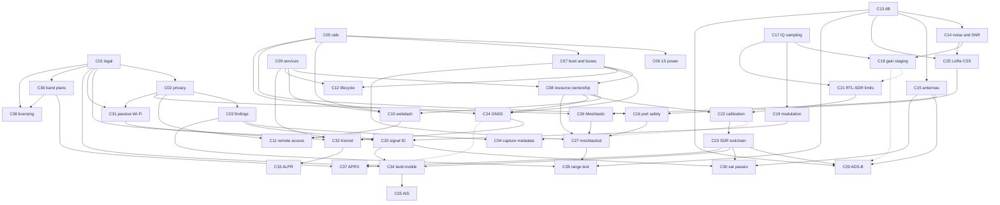
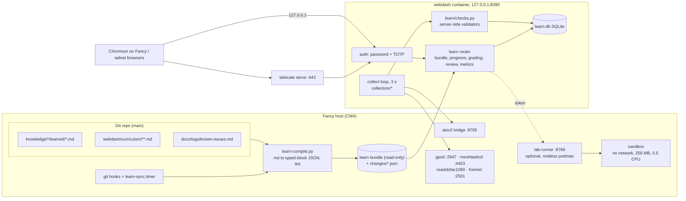

# Learning platform plan: the Chart Table

**Status: MVP built 2026-09-25 (S2–S10, branch `claude/learning-mvp-20260924`).** S0 decisions logged; S1 skipped (risk accepted); S11–S14 not started. Track A content has **not** had its senior-rf-engineer review — that run was cut off by a usage limit. This is the design for a self-hosted
learning platform that runs on Fancy and lives inside [webdash](../../webdash/). It extends the
learning layer already sketched in [`webdash-design.md`](webdash-design.md) (§Learning layer,
§Syllabus, §Missions) and revises it where the analysis below found problems.

It was produced by the project team. Each section names the agent whose report it is built on;
the lead merged the reports, resolved their conflicts, and re-checked the claims marked
*checked 2026-09-24* on the device.

| Agent | Slice |
|---|---|
| [`syllabus-designer`](../../.claude/agents/syllabus-designer.md) | Concepts, dependency graph, difficulty, hands-on candidates, tracks, module specs |
| [`guided-learning`](../../.claude/agents/guided-learning.md) | Labs and their automated validation |
| [`tutor`](../../.claude/agents/tutor.md) | Gap coverage and external references |
| [`web-ui-engineer`](../../.claude/agents/web-ui-engineer.md) | Content model, lab execution, sync, architecture, security, metrics |
| [`design-planner`](../../.claude/agents/design-planner.md) | Features as interface, wireframes |
| [`creative-director`](../../.claude/agents/creative-director.md) | Naming, voice, endorsements |
| [`senior-rf-engineer`](../../.claude/agents/senior-rf-engineer.md) | Technical review: numbers, physics, and that every item fits Fancy's hardware ([§2.0](#20-hardware-scope)) |

Delivery constraints: **self-hosted from Fancy** (CM4 Lite 8 GB, NVMe root, aarch64, on battery
some of the time) and **integrated with webdash** (FastAPI + vanilla JS in Docker, bound to
`127.0.0.1:8090`, published tailnet-only by `tailscale serve`, password + TOTP login).

## Assumptions

| # | Assumption | Basis |
|---|---|---|
| A1 | One owner-learner. Guests (0–5, over the tailnet) are a later option, not the MVP | [`software/webdash.md`](../../software/webdash.md) (single TOTP account) |
| A2 | Works offline. No CDN, no cloud service, no webfont | [`webdash-design.md`](webdash-design.md) §Content format |
| A3 | US rules only; location recorded as a grid square (EM95) | [`us-spectrum-and-legal.md`](../../knowledge/rf-fundamentals/learned/us-spectrum-and-legal.md), checklist 3.3 |
| A4 | Fancy's only transmitter is the SX1262 (Part 15 ISM). The curriculum transmits nowhere else | [`licensing-path-us.md`](../../knowledge/ham-radio/learned/licensing-path-us.md) |
| A5 | A second LoRa node (the owner's Heltec V3) exists for the optional two-node lab | checklist 3.10 |
| A6 | Hardware state as of 2026-09-24: AC1200 not arrived; RT5370 (2.4 GHz only) on hand for monitor mode but **unplugged**; no RTC cell; 18650 pack unverified | [`CLAUDE.md`](../../CLAUDE.md) build state; guided-learning probe |
| A7 | Installed: rtl-sdr tools, rtl_ais, multimon-ng, direwolf, sox, SDR++, gqrx, gpsd clients, Kismet, meshtastic CLI, readsb, PyGPSClient, Docker. **Not installed:** SatDump, gpredict, inspectrum, WSJT-X, dump978-fa (noaa-apt is moot: APT ended 2025) | syllabus-designer `command -v` check, 2026-09-24 |
| A9 | **Not on hand:** a BLE sniffer (nRF51822/nRF52840 — the Kismet nRF udev rules come with installed packages, not hardware), an ESP32-S3, a calibrated signal source, a 137 MHz circular or V-dipole antenna, a 1090 MHz or 6 m antenna. The only Bluetooth radio is the CM4's onboard `hci0`. The SDR antenna is one telescopic whip, lengths unmeasured | senior-rf-engineer review; `lsusb`, `iw dev`, BOM, accessories, inventory |
| A8 | "Repo content" means this repository only. Nothing below is invented; external facts are marked and their sources are in `knowledge/` | brief |

## Phase 1 — Repository analysis

### 1.1 Inventory

| Item | Finding |
|---|---|
| README | [`README.md`](../../README.md): hardware summary, layout, doc index, upstream references |
| Docs | [`docs/`](../) — BOM, 3 checklists, 7 runbooks, 5 reference docs, 4 living logs, records; index in [`documentation-index.md`](../documentation-index.md) |
| Knowledge base | [`knowledge/`](../../knowledge/README.md) — 7 disciplines × (learned, configs, runbooks, findings); 19 `learned/` docs, 7 configs, 9 runbooks, **0 findings**; 5 templates |
| Tracked files | 250 (2026-09-24): 152 Markdown, 27 JPEG, 23 skill templates, 18 Python, 5 JS, 4 HTML, 4 polkit/udev rules, 3 shell, 2 systemd units, 1 compose file, 1 Dockerfile |
| Languages | Markdown (docs, the bulk); Python 3.12 (webdash app, host helpers, gpsd relay); vanilla ES-module JS + CSS (webdash UI); POSIX shell (config helpers) |
| History | First commit 2026-09-04; latest 2026-09-24 |
| License | **None** — see [§1.7](#17-license-implications) |

Directory tree, depth 3 (images and `__pycache__` omitted):

```
.claude/        agents/ (9 agents)  hooks/  scripts/  skills/hardware-project-repo/
configs/        boot/ gpsd/ kismet/ meshtastic/ modprobe.d/ polkit/ profile.d/ sdr/ sdrpp/ systemd/ udev/
docs/           checklists/ logs/ records/invoices/ reference/ runbooks/
drivers/        README.md
firmware/       README.md
hardware/       datasheets/ specs/ mechanical.md
images/         inventory/
knowledge/      _templates/  aerospace/ communications/ ham-radio/ mesh-networks/
                rf-fundamentals/ sdr/ wardriving/   (each: configs/ findings/ learned/ runbooks/)
presentation/   talk source, CFP, demo plan
software/       per-app notes (aiov2_ctl, gps, meshtastic, kismet, adsb-tar1090, sdr-stack, webdash)
webdash/        Dockerfile  docker-compose.yml  app/{auth,main,proxy}.py  app/collectors/  app/static/  host-helpers/
```

Dependencies:

| Layer | Dependency | License (read from package metadata in the running container, 2026-09-24) |
|---|---|---|
| webdash Python ([`requirements.txt`](../../webdash/requirements.txt)) | fastapi 0.115.6 | MIT |
| | jinja2 3.1.5, itsdangerous 2.2.0, segno 1.6.1 | BSD |
| | uvicorn 0.34.0, psutil 6.1.1, httpx 0.28.1 | BSD-3-Clause |
| | pyotp 2.9.0 | MIT |
| | python-multipart 0.0.20 | Apache-2.0 |
| | **meshtastic 2.7.11** | **GPL-3.0-only** |
| Container base | `python:3.12-slim` ([`Dockerfile`](../../webdash/Dockerfile)) | Debian + PSF |
| Host services webdash reads | gpsd `:2947`, meshtasticd `:4403`, Kismet `:2501`, readsb/tar1090, aiov2 bridge `:8765` | [`webdash-architecture.md`](webdash-architecture.md) |
| Host tools the labs use | rtl-sdr, multimon-ng, sox, rtl_ais, Kismet, gpsd-clients, aiov2_ctl | [`software/`](../../software/README.md) |

### 1.2 Concept extraction

38 concepts (syllabus-designer). Every definition is sourced from the paths in the table.

| ID | Concept | Source paths | Definition |
|---|---|---|---|
| C01 | Legal posture | [`us-spectrum-and-legal.md`](../../knowledge/rf-fundamentals/learned/us-spectrum-and-legal.md), [`knowledge/README.md`](../../knowledge/README.md) | Classify anything, decode only open standards, transmit only under Part 15 or a licence held |
| C02 | Privacy rules | [`CLAUDE.md`](../../CLAUDE.md) §Conventions, [`capture-metadata-conventions.md`](../../knowledge/rf-fundamentals/configs/capture-metadata-conventions.md), [`software/gps.md`](../../software/gps.md) | UTC and grid square only; never commit MACs, coordinates, message text or PSKs |
| C03 | Findings method | [`knowledge/README.md`](../../knowledge/README.md), [`_templates/`](../../knowledge/_templates/), [`signal-identification-workflow.md`](../../knowledge/rf-fundamentals/learned/signal-identification-workflow.md) | Every observation becomes a dated finding graded confirmed / probable / unknown |
| C04 | Capture metadata | [`capture-metadata-conventions.md`](../../knowledge/rf-fundamentals/configs/capture-metadata-conventions.md), [`gain-and-sample-rate-profiles.md`](../../knowledge/sdr/configs/gain-and-sample-rate-profiles.md) | `YYYYMMDDTHHMMZ_freq_rate_gain_label.ext` plus antenna, PPM, gain, software; raw IQ tracked by sha256, not committed |
| C05 | AIO V2 rails | [`software/aiov2_ctl.md`](../../software/aiov2_ctl.md), [`pinout-gpio.md`](pinout-gpio.md) | GPS 27, LORA 16, SDR 7, USB 23 — GPIO-switched supplies |
| C06 | 1S power | [`power-budget.md`](power-budget.md), checklist §4 | AXP228 1S PMIC, JP1, parallel cells; ~5.0 W idle and SDR +0.64 W measured; runtime = Wh ÷ W |
| C07 | Boot config and buses | [`config-cm4.txt`](../../configs/boot/config-cm4.txt), [`cmdline-notes.md`](../../configs/boot/cmdline-notes.md) | `i2c-rtc`, `enable_uart`, `spi1-1cs`; console removed from `serial0` |
| C08 | Resource ownership | [`sdr-swap.sh`](../../configs/sdr/sdr-swap.sh), [`blacklist-rtl-dvb.conf`](../../configs/modprobe.d/blacklist-rtl-dvb.conf), [`known-issues.md`](../logs/known-issues.md) | One owner per device or port: readsb vs rtl tools, gpsd vs meshtasticd on `serial0`, meshtasticd's single API client vs webdash |
| C09 | Services and the journal | [`configs/systemd/README.md`](../../configs/systemd/README.md), [`first-packet-alert.service`](../../configs/meshtastic/first-packet-alert.service) | `systemctl`/`journalctl`; a crash-loop can be the normal state (readsb with SDR off) |
| C10 | webdash architecture | [`webdash-architecture.md`](webdash-architecture.md), [`collectors/`](../../webdash/app/collectors/), [`aiov2-bridge.py`](../../webdash/host-helpers/aiov2-bridge.py) | Aggregate, don't own: collectors with short timeouts, a host bridge for rails, a 3 s cached loop |
| C11 | Remote access and trust | [`software/webdash.md`](../../software/webdash.md), [`auth.py`](../../webdash/app/auth.py), [`headless-access.md`](../runbooks/headless-access.md), [`50-webdash-poweroff.rules`](../../configs/polkit/50-webdash-poweroff.rules) | Loopback bind + `tailscale serve`, TOTP, a scoped polkit rule |
| C12 | Platform lifecycle | [`nvme-boot.md`](../runbooks/nvme-boot.md), [`backup-and-restore.md`](../runbooks/backup-and-restore.md) | `BOOT_ORDER`, NVMe-only boot, baseline images, restore drill |
| C13 | dB and link budget | [`db-and-link-budget.md`](../../knowledge/rf-fundamentals/learned/db-and-link-budget.md) | Gains and losses add in dB; FSPL = 20 log d + 20 log f + 32.45; radio horizon |
| C14 | Noise and SNR | [`db-and-link-budget.md`](../../knowledge/rf-fundamentals/learned/db-and-link-budget.md), [`noise-floor-baseline.md`](../../knowledge/rf-fundamentals/runbooks/noise-floor-baseline.md) | −174 dBm/Hz + 10 log BW + NF; SNR against the mode's requirement |
| C15 | Antennas | [`antenna-basics.md`](../../knowledge/rf-fundamentals/learned/antenna-basics.md), [`antennas-and-rf-connectors.md`](antennas-and-rf-connectors.md) | λ/4 ≈ 75000/f mm; ground plane; gain is redirection; polarisation loss |
| C16 | RF port safety | [`antennas-and-rf-connectors.md`](antennas-and-rf-connectors.md), [`rtl-sdr-limits.md`](../../knowledge/sdr/learned/rtl-sdr-limits.md) | ANT1 is the only TX port; SDR bulkhead carries a 5 V bias tee; SMA vs RP-SMA |
| C17 | IQ sampling | [`sampling-and-bandwidth.md`](../../knowledge/rf-fundamentals/learned/sampling-and-bandwidth.md) | Usable BW ≈ sample rate; DC spike; decimation; ~4 MB/s at 2.048 MS/s |
| C18 | Gain staging | [`receiver-performance.md`](../../knowledge/rf-fundamentals/learned/receiver-performance.md) | 8-bit ADC ≈ 48 dB range; manual gain to the knee; overload symptoms |
| C19 | Modulation on a waterfall | [`modulation-basics.md`](../../knowledge/rf-fundamentals/learned/modulation-basics.md) | Recognise AM/NFM/WFM/SSB/OOK/FSK/PSK/LoRa CSS/PPM by width, shape, timing |
| C20 | Signal-ID workflow | [`signal-identification-workflow.md`](../../knowledge/rf-fundamentals/learned/signal-identification-workflow.md), [`signal-id.md`](../../knowledge/_templates/signal-id.md) | Observe → allocation → reference → decode → log, with honest confidence |
| C21 | RTL-SDR limits | [`rtl-sdr-limits.md`](../../knowledge/sdr/learned/rtl-sdr-limits.md), [`aio-v2-vs-hackrf.md`](../../knowledge/sdr/learned/aio-v2-vs-hackrf.md) | ~24 MHz–1.766 GHz, 2.048 MS/s practical, receive-only, one tuner |
| C22 | SDR calibration | [`first-capture-and-calibration.md`](../../knowledge/sdr/runbooks/first-capture-and-calibration.md), checklist 3.4–3.6 | `rtl_test -t/-s/-p`; PPM ≈ +1 measured 2026-09-24 |
| C23 | SDR toolchain | [`software/sdr-stack.md`](../../software/sdr-stack.md), [`scanner-monitoring-session.md`](../../knowledge/communications/runbooks/scanner-monitoring-session.md) | `rtl_fm \| aplay`/`multimon-ng`/`sox`, `rtl_power`, `rtl_sdr`, SDR++/gqrx |
| C24 | GNSS and time | [`software/gps.md`](../../software/gps.md), [`gpsd.default`](../../configs/gpsd/gpsd.default), [`gpsd-nmea-relay.py`](../../configs/gpsd/gpsd-nmea-relay.py), [`gps.py`](../../webdash/app/collectors/gps.py) | NMEA → gpsd JSON, fix modes, satellites used vs visible, RTC sync |
| C25 | LoRa CSS | [`lora-modulation-and-airtime.md`](../../knowledge/mesh-networks/learned/lora-modulation-and-airtime.md) | SF/BW/CR, symbol time 2^SF/BW, processing gain, airtime |
| C26 | Meshtastic model | [`meshtastic-architecture.md`](../../knowledge/mesh-networks/learned/meshtastic-architecture.md), [`meshtastic-baseline.md`](../../knowledge/mesh-networks/configs/meshtastic-baseline.md) | Roles, channel = name + PSK + radio settings, flooding with hop limit, MQTT |
| C27 | meshtasticd operations | [`software/meshtastic.md`](../../software/meshtastic.md), [`us915.yaml`](../../configs/meshtastic/us915.yaml) | Daemon owns SPI; CLI is a TCP 4403 client; the primary channel name sets the frequency slot |
| C28 | Mesh range test | [`node-bringup-and-range-test.md`](../../knowledge/mesh-networks/runbooks/node-bringup-and-range-test.md) | Stepwise RSSI/SNR table; strong RSSI without decode means config mismatch |
| C29 | ADS-B | [`adsb-basics.md`](../../knowledge/aerospace/learned/adsb-basics.md), [`adsb-receive-tar1090.md`](../../knowledge/aerospace/runbooks/adsb-receive-tar1090.md), [`software/adsb-tar1090.md`](../../software/adsb-tar1090.md) | 1090ES PPM, DF17, CPR even/odd, readsb → tar1090 |
| C30 | Satellite passes | [`weather-satellites.md`](../../knowledge/aerospace/learned/weather-satellites.md), [`noaa-apt-reception.md`](../../knowledge/aerospace/runbooks/noaa-apt-reception.md), [`vhf-uhf-monitoring-and-satellite-pass.md`](../../knowledge/ham-radio/runbooks/vhf-uhf-monitoring-and-satellite-pass.md) | AOS/LOS, elevation ≥ 30°, TLE freshness, Doppler, record then decode |
| C31 | Passive Wi-Fi | [`wifi-capture-fundamentals.md`](../../knowledge/wardriving/learned/wifi-capture-fundamentals.md) | Monitor mode, beacons and probes, MAC randomisation, channel hopping |
| C32 | Kismet survey | [`kismet-passive-survey.md`](../../knowledge/wardriving/configs/kismet-passive-survey.md), [`passive-survey-session.md`](../../knowledge/wardriving/runbooks/passive-survey-session.md), [`software/kismet.md`](../../software/kismet.md), [`kismet_site.conf`](../../configs/kismet/kismet_site.conf) | Site config, capabilities without sudo, logs outside the repo, aggregate-only findings |
| C33 | ALPR detection (elective) | [`flock-safety-alpr-signatures.md`](../../knowledge/wardriving/learned/flock-safety-alpr-signatures.md), [`flock-camera-wardriving-detection.md`](../../knowledge/wardriving/runbooks/flock-camera-wardriving-detection.md) | OUI/SSID/BLE signatures; every hit needs visual corroboration |
| C34 | Land-mobile monitoring | [`digital-voice-and-trunking.md`](../../knowledge/communications/learned/digital-voice-and-trunking.md), [`monitoring-frequency-list.md`](../../knowledge/communications/configs/monitoring-frequency-list.md) | Band survey, recognise analog vs digital (probable DMR/P25) and trunking by width and pattern; encryption is not visible on a waterfall; no content |
| C35 | AIS | [`ais-and-maritime.md`](../../knowledge/communications/learned/ais-and-maritime.md) | 161.975/162.025 MHz GMSK via `rtl_ais`; silence expected inland |
| C36 | Band plans | [`band-plans-and-privileges.md`](../../knowledge/ham-radio/learned/band-plans-and-privileges.md), [`local-repeaters-and-memories.md`](../../knowledge/ham-radio/configs/local-repeaters-and-memories.md) | 2 m / 70 cm segments, repeater offsets, CTCSS |
| C37 | APRS and digital modes | [`digital-modes-and-aprs.md`](../../knowledge/ham-radio/learned/digital-modes-and-aprs.md) | FM → AFSK1200 → AX.25 via multimon-ng; FT8 needs the clock within ~1 s |
| C38 | Licensing | [`licensing-path-us.md`](../../knowledge/ham-radio/learned/licensing-path-us.md) | Tech / General / Extra, VEC exams; a licence adds capability, it doesn't legalise Fancy |
| C39 | Authorized active testing & authorization discipline | [`CLAUDE.md`](../../CLAUDE.md), [`software/aircrack-ng.md`](../../software/aircrack-ng.md), [`us-spectrum-and-legal.md`](../../knowledge/rf-fundamentals/learned/us-spectrum-and-legal.md) | Own-network-or-written-authorization rule; CVP lifts the default dual-use block but authorizes no specific target; C2 / mass-exfil / ransomware stay prohibited; approval ≠ permission |
| C40 | WPA2 four-way handshake & offline audit | [`wifi-wpa2-handshake-audit.md`](../runbooks/wifi-wpa2-handshake-audit.md), [`software/aircrack-ng.md`](../../software/aircrack-ng.md) | EAPOL four-way handshake, deauth (802.11w/PMF caveat), PMKID, wordlist crack; WPA3/SAE not crackable this way; Fancy is capture-only, cracking offloads to a GPU host |
| C41 | Passive packet capture | [`packet-capture.md`](platform-basics/packet-capture.md), [`tshark-capture.sh`](../../webdash/host-helpers/tshark-capture.sh), [`collectors/tshark.py`](../../webdash/app/collectors/tshark.py) | Receive-only tap on Fancy's own interfaces; capture vs display filter; ring buffer bound = file size × count; address-free summary, addresses stay in the on-disk pcap |
| C42 | Reading link anomalies | [`packet-capture.md`](platform-basics/packet-capture.md), [`known-issues.md`](../logs/known-issues.md) | Protocol mix as shape; TCP retransmit / dup-ack = loss (weak link), reset = endpoint/filter, ICMP unreachable = routing; zero of the three TCP signals is the healthy baseline |

### 1.3 Dependency graph

Adjacency list, concept → prerequisites. `(s)` is a soft prerequisite: it deepens understanding
but does not block the lab.

```
C01: —              C02: C01            C03: C02             C04: C03, C22(s)
C05: —              C06: C05            C07: C05             C08: C07, C09
C09: —              C10: C05, C08, C09  C11: C10, C02        C12: C07, C09
C13: —              C14: C13            C15: C13             C16: C15, C05
C17: —              C18: C14, C17       C19: C17             C20: C19, C03, C01
C21: C17, C18(s)    C22: C21, C08       C23: C22             C24: C05, C07, C08
C25: C13, C14       C26: C25, C02       C27: C26, C07, C08, C16
C28: C27, C13, C03  C29: C23, C15, C13, C18(s)               C30: C23, C15, C20
C31: C01, C02       C32: C31, C24, C09  C33: C32
C34: C20, C23, C01  C35: C34
C36: C01            C37: C36, C23, C24(s)                    C38: C36, C01
C39: C01, C31       C40: C31, C39
C41: C09, C10       C42: C41
```



### 1.4 Difficulty

Rubric: **1** recall a value, no commands · **2** run a given command and interpret one output ·
**3** multi-step procedure or config, several metrics, or basic arithmetic · **4** diagnosis or
trade-offs across two or more subsystems, or planning around the outside world · **5** designing
an experiment, depending on timed external events, or a legal judgment at the edge.

| 1 | 2 | 3 | 4 | 5 |
|---|---|---|---|---|
| C02, C05 | C01, C03, C04, C09, C15, C16, C19, C21, C22, C24, C31, C35, C36, C38 | C06, C07, C08, C10, C13, C14, C17, C20, C23, C25, C26, C29, C32, C34, C37 | C11, C12, C18, C27, C28, C33 | C30 |

### 1.5 Hands-on candidates

Key: **R** safe to repeat · **R\*** safe to repeat but disturbs another service (restore it) ·
**G** gated (side effects or hazard) · **B** blocked (hardware or tool missing).

| # | Exercise | Source | Runtime on Fancy | Status |
|---|---|---|---|---|
| H01 | `aiov2_ctl --status/--watch/--measure <RAIL>` | [`software/aiov2_ctl.md`](../../software/aiov2_ctl.md) | aiov2_ctl, bridge `:8765` | R; turning a rail off stops its service |
| H02 | PMIC readings from sysfs | [`power-budget.md`](power-budget.md) | `/sys/class/power_supply/axp20x-battery` | R; discharge tests **G** (stop at 3.5 V; unverified 18650s) |
| H03 | Bus presence: `ls /dev/rtc0 /dev/spidev1.* /dev/serial0`; `cat /proc/cmdline` | [`config-cm4.txt`](../../configs/boot/config-cm4.txt) | kernel | R (read-only). Editing `config.txt` is never a lab |
| H04 | Reproduce `usb_claim_interface error -6`, then free the dongle | [`sdr-swap.sh`](../../configs/sdr/sdr-swap.sh), [`known-issues.md`](../logs/known-issues.md) | readsb + scoped sudoers | R\*; `sdr-swap.sh` is not on `PATH` — run it from the repo or use `sudo systemctl stop/start readsb` |
| H05 | `rtl_test -t`, `-s 2048000`, `-p` | [`first-capture-and-calibration.md`](../../knowledge/sdr/runbooks/first-capture-and-calibration.md) | SDR rail, readsb stopped | R\* |
| H06 | `rtl_power` sweeps | [`noise-floor-baseline.md`](../../knowledge/rf-fundamentals/runbooks/noise-floor-baseline.md) | SDR rail | R\*; CSVs outside the repo |
| H07 | NOAA WX `rtl_fm \| aplay` | [`scanner-monitoring-session.md`](../../knowledge/communications/runbooks/scanner-monitoring-session.md) §1 | SDR, audio | R\*; verified 2026-09-24 (build log) |
| H08 | 30 s `rtl_sdr` capture + sha256 | [`first-capture-and-calibration.md`](../../knowledge/sdr/runbooks/first-capture-and-calibration.md) §4 | SDR, ~15 MB disk | R\*; inspectrum viewing step **B** |
| H09 | Airband AM | [`software/sdr-stack.md`](../../software/sdr-stack.md) | SDR | R\*; local frequency not in the repo |
| H10 | ADS-B first light | [`adsb-receive-tar1090.md`](../../knowledge/aerospace/runbooks/adsb-receive-tar1090.md) | SDR rail, readsb, tar1090 | R; checklist 3.7 still open |
| H11 | ADS-B gain sweep | same, §4 | readsb config edits | G (record and restore config) |
| H12 | `cgps -s`, `gpspipe`, PyGPSClient via relay | [`software/gps.md`](../../software/gps.md), [`gpsd-nmea-relay.py`](../../configs/gpsd/gpsd-nmea-relay.py) | GPS rail, gpsd | R |
| H13 | Time to first fix | [`software/gps.md`](../../software/gps.md) | GPS rail, sky view | R; `gpsd -n` keeps the receiver warm |
| H14 | `journalctl -u meshtasticd \| grep "Set radio"` | [`software/meshtastic.md`](../../software/meshtastic.md) | meshtasticd | R (does not disturb webdash) |
| H15 | `meshtastic --host localhost --info` | [`software/meshtastic.md`](../../software/meshtastic.md) | meshtasticd `:4403` | R\*: **disconnects webdash's mesh client** |
| H16 | Message or traceroute to the second node | checklist 3.10 | LORA rail, ANT1 | G: **transmits** (Part 15, 902–928 MHz) |
| H17 | Re-arm the first-packet alert | [`first-packet-alert.sh`](../../configs/meshtastic/first-packet-alert.sh) | systemd user unit | R; fired 2026-09-24T01:39Z |
| H18 | Two-node range test | [`node-bringup-and-range-test.md`](../../knowledge/mesh-networks/runbooks/node-bringup-and-range-test.md) | LORA, second node, GPS | G (TX; outdoors) |
| H19 | `iw dev`, `iw list` modes | [`software/kismet.md`](../../software/kismet.md) | RT5370 | R; adapter unplugged 2026-09-24 |
| H20 | Kismet foreground survey | [`passive-survey-session.md`](../../knowledge/wardriving/runbooks/passive-survey-session.md) | `sg kismet -c 'kismet --no-ncurses-wrapper'` | G: logs hold MACs and coordinates; the service crash-looped until 2026-09-25 (likely fixed by `httpd_bind_address=127.0.0.1`, service start not yet re-tested — known issue), so the foreground run is still the path |
| H21 | APRS decode | [`vhf-uhf-monitoring-and-satellite-pass.md`](../../knowledge/ham-radio/runbooks/vhf-uhf-monitoring-and-satellite-pass.md) §A | SDR; whip extended toward λ/4 ≈ 519 mm (maximum length unmeasured; no ground plane) | R\* |
| H22 | Repeater and simplex listening | same §A | SDR | R\* |
| H23 | VHF/UHF band survey | [`scanner-monitoring-session.md`](../../knowledge/communications/runbooks/scanner-monitoring-session.md) §2 | SDR | R\* |
| H24 | `rtl_ais` | [`ais-and-maritime.md`](../../knowledge/communications/learned/ais-and-maritime.md) | SDR | R\*; silence expected inland |
| H25 | ISS packet pass capture | ham runbook §B | SDR, pass prediction | R\*, pass-dependent; gpredict missing. The ISS packet station has moved between 145.825 and 437.825 MHz and been off — check [ARRL](https://www.arrl.org/news/iss-packet-digipeater-is-now-on-70-centimeters)/AMSAT status first |
| H26 | NOAA APT record and decode | [`noaa-apt-reception.md`](../../knowledge/aerospace/runbooks/noaa-apt-reception.md) | SDR, sox | **Removed**: NOAA-18/19/15 were decommissioned Jun–Aug 2025 ([NOAA OSPO](https://ospo.noaa.gov/data/messages/2025/08/MSG_20250820_1410.html)). Meteor-M LRPT **requires SatDump and a 137 MHz V-dipole/QFH (not on hand)** |
| H27 | webdash and bridge health | [`software/webdash.md`](../../software/webdash.md) | `curl` `:8090/api/health`, `:8765/status` | R |
| H28 | FSPL, horizon, λ/4 by hand | [`db-and-link-budget.md`](../../knowledge/rf-fundamentals/learned/db-and-link-budget.md) | none | R |
| H29 | File-level backup | [`backup-and-restore.md`](../runbooks/backup-and-restore.md) | external media | G |
| H30 | ALPR detection | [`flock-camera-wardriving-detection.md`](../../knowledge/wardriving/runbooks/flock-camera-wardriving-detection.md) | ESP32 or AC1200, WiGLE key | **B** |
| H31 | FT8 on 2 m | [`digital-modes-and-aprs.md`](../../knowledge/ham-radio/learned/digital-modes-and-aprs.md) | WSJT-X | **B**: WSJT-X not installed; needs a USB-demod → virtual-audio path. Clock is fine online (NTP/GPS). 2 m FT8 on a whip inland is rare; 6 m needs a ~1.4 m antenna (not on hand) |
| H32 | Staged vs installed config drift (`cmp`) | [`configs/README.md`](../../configs/README.md) | read-only | R; 5 pairs identical 2026-09-24 |
| H33 | Passive BLE advertisements: `sudo hcitool lescan --passive`, `btmon` | [`ble-passive-observation.md`](../../knowledge/wardriving/learned/ble-passive-observation.md) | onboard `hci0` | R — verified 2026-09-25, but only after pausing bluetoothd's background scan (`hcitool cmd 0x08 0x000c 00 00`) and restoring it (`systemctl restart bluetooth`); on its own the scan fails with Command Disallowed. **Never** `bluetoothctl scan on`, `btmgmt find` or Kismet's `linuxbluetooth` source — they scan actively, which transmits |

### 1.6 Gaps

Concepts the repo uses but never explains. IDs B1–B11 and P1–P8 are from the tutor's sweep; G-rows
are the syllabus-designer's additions not covered by those. External references for each are
now in the discipline READMEs under **Learning-platform references**, and for P-rows in
[`knowledge/README.md`](../../knowledge/README.md) §Platform references.

| ID | Gap | Where it is used unexplained | Needed by |
|---|---|---|---|
| B1 | GNSS basics: fix modes, used vs visible, DOP, TTFF, C/N0, NMEA vs gpsd JSON, GNSS time vs RTC | [`software/gps.md`](../../software/gps.md), checklist 3.2–3.3, [`webdash-design.md`](webdash-design.md) gap 1 | M3 |
| B2 | Relative vs absolute power (dBFS vs dBm) | [`noise-floor-baseline.md`](../../knowledge/rf-fundamentals/runbooks/noise-floor-baseline.md), readsb `rssi` | M5, M6 |
| B3 | Propagation: line of sight, Fresnel zone, Sporadic-E, ducting | [`rf-fundamentals/README.md`](../../knowledge/rf-fundamentals/README.md), [`band-plans-and-privileges.md`](../../knowledge/ham-radio/learned/band-plans-and-privileges.md) | M2, M4 |
| B4 | Reading an FFT/waterfall: FFT size, RBW, averaging | [`modulation-basics.md`](../../knowledge/rf-fundamentals/learned/modulation-basics.md), [`software/sdr-stack.md`](../../software/sdr-stack.md) | M5, M8 |
| B5 | Reading packets: RSSI vs SNR, negative SNR, channel utilisation, hops, NodeDB | [`node-bringup-and-range-test.md`](../../knowledge/mesh-networks/runbooks/node-bringup-and-range-test.md), [`mesh.py`](../../webdash/app/collectors/mesh.py) | M4 |
| B6 | Mode A/C/S, squitter, ICAO address, squawk | [`adsb-basics.md`](../../knowledge/aerospace/learned/adsb-basics.md) | M6 |
| B7 | TLE, AOS/LOS, pass geometry, Doppler | [`noaa-apt-reception.md`](../../knowledge/aerospace/runbooks/noaa-apt-reception.md), [`weather-satellites.md`](../../knowledge/aerospace/learned/weather-satellites.md) | M9 |
| B8 | GMSK, C4FM, AFSK; baud vs bit rate; TDMA/FDMA | [`ais-and-maritime.md`](../../knowledge/communications/learned/ais-and-maritime.md), [`digital-voice-and-trunking.md`](../../knowledge/communications/learned/digital-voice-and-trunking.md) | M10, M12 |
| B9 | Maidenhead grid locator | [`CLAUDE.md`](../../CLAUDE.md), [`capture-metadata-conventions.md`](../../knowledge/rf-fundamentals/configs/capture-metadata-conventions.md) | M0, M3 |
| B10 | BLE passive observation | [`ble-passive-observation.md`](../../knowledge/wardriving/learned/ble-passive-observation.md) (written 2026-09-25), [`flock-safety-alpr-signatures.md`](../../knowledge/wardriving/learned/flock-safety-alpr-signatures.md) | M7, E1 |
| B11 | OUI, BSSID vs SSID, regulatory domain, DFS | [`80211-identifiers-and-regdom.md`](../../knowledge/wardriving/learned/80211-identifiers-and-regdom.md) (written 2026-09-25), [`flock-safety-alpr-signatures.md`](../../knowledge/wardriving/learned/flock-safety-alpr-signatures.md), [`cmdline-notes.md`](../../configs/boot/cmdline-notes.md) | M7 |
| P1 | systemd units, enable vs start, restart loops, `journalctl` | [`configs/systemd/README.md`](../../configs/systemd/README.md), 33+ files | M1b |
| P2 | Kernel drivers, device nodes, udev, modprobe | [`configs/udev/`](../../configs/udev/), [`first-rf-checkout.md`](../runbooks/first-rf-checkout.md) | M1b |
| P3 | Device tree, overlays, `config.txt`, serial console | [`config-cm4.txt`](../../configs/boot/config-cm4.txt), [`cmdline-notes.md`](../../configs/boot/cmdline-notes.md) | M1b |
| P4 | UART / SPI / I²C / GPIO; a "rail" as a GPIO-switched supply | [`pinout-gpio.md`](pinout-gpio.md), [`software/aiov2_ctl.md`](../../software/aiov2_ctl.md) | M1, M1b |
| P5 | Docker and Compose | [`software/webdash.md`](../../software/webdash.md), [`webdash-architecture.md`](webdash-architecture.md) | M1b |
| P6 | Tailscale / WireGuard, `serve` vs Funnel | [`software/webdash.md`](../../software/webdash.md), [`headless-access.md`](../runbooks/headless-access.md) | M1b |
| P7 | TOTP and session auth | [`software/webdash.md`](../../software/webdash.md), [`auth.py`](../../webdash/app/auth.py) | M0 |
| P8 | 1S Li-ion, PMIC, Wh, throttling, cell red flags | [`power-budget.md`](power-budget.md), [`CLAUDE.md`](../../CLAUDE.md) blockers | M1 |
| G7 | How the Meshtastic frequency slot derives from the primary channel name | [`software/meshtastic.md`](../../software/meshtastic.md), [`us915.yaml`](../../configs/meshtastic/us915.yaml) | M4 |
| G8 | Part 15 detail (§15.247) and RF exposure (OET 65) | [`lora-modulation-and-airtime.md`](../../knowledge/mesh-networks/learned/lora-modulation-and-airtime.md) | M0, M4 |
| G9 | SigMF: named, never shown | [`capture-metadata-conventions.md`](../../knowledge/rf-fundamentals/configs/capture-metadata-conventions.md) | M5 |
| G14 | Reticulum, MeshCore, LoRaWAN | [`mesh-networks/README.md`](../../knowledge/mesh-networks/README.md) | future |
| G15 | UAT 978, MLAT, feeding | [`adsb-basics.md`](../../knowledge/aerospace/learned/adsb-basics.md) | M6 extension; UAT requires `dump978-fa` (not installed) at 2.083 MS/s (*verify sample loss*) |
| G16 | State rules for public-safety listening (SC) | [`digital-voice-and-trunking.md`](../../knowledge/communications/learned/digital-voice-and-trunking.md) | M12 |
| G17 | Dashboard literacy: every field, source and unit | [`webdash-design.md`](webdash-design.md) gap 6 | M0 |
| G18 | All `findings/` folders empty | [`knowledge/README.md`](../../knowledge/README.md) | every lab |
| G19 | Tools not installed: SatDump (LRPT), gpredict, inspectrum, WSJT-X, dump978-fa | runbooks above | M5, M9 ext., M10 ext., M6 ext. |

### 1.7 License implications

| Question | Finding | Implication |
|---|---|---|
| Is there a license? | **Yes, since 2026-09-24:** [`LICENSE`](../../LICENSE) — docs, curriculum and photos CC BY 4.0; code and configs MIT; Kismet-derived udev rules excluded. Before that there was none | Anyone may use it for education; reuse in other work requires acknowledgement |
| Derivative content | Lessons are derived from the owner's own `knowledge/` and `docs/` text | Curriculum files are Markdown, so they fall under CC BY 4.0 |
| Redistribution to guests | Guests view pages served from Fancy; no copies are distributed | Not redistribution. Sharing an export of the curriculum would be |
| Third-party text | The repo links to datasheets and upstream docs rather than copying them ([`hardware/datasheets/README.md`](../../hardware/datasheets/README.md)) | Keep it that way: lessons **link** to external sources and never paste their text beyond a short attributed quotation. Each source's own licence governs anything more |
| Code dependencies | webdash's image includes **meshtastic (GPL-3.0-only)**; the rest are MIT / BSD / Apache-2.0 (§1.1) | Running it privately is fine. **Distributing the webdash image or code** would bring GPL-3.0 obligations for the combined work. Decide this before publishing webdash |
| Vendored front-end code | The optional sandbox terminal (§3.3) would vendor xterm.js (MIT) | Keep its licence file next to it |
| Attribution | Certificates and endorsements name no third party | None |

## Phase 2 — Curriculum design

This revises the 12-module / 3-track syllabus in [`webdash-design.md`](webdash-design.md)
§Syllabus. Module IDs are kept so the existing station → module links still hold.

| Change from the existing syllabus | Why |
|---|---|
| **New M1b "Who owns what"** in every track | Most entries in [`known-issues.md`](../logs/known-issues.md) are ownership conflicts (error -6, `serial0`, meshtasticd's single client); no module taught this |
| **New M12 "Land-mobile and maritime monitoring"** | `knowledge/communications/` had no module |
| Track C gains M1 and M1b | The old Track C skipped M1 though M5 required it |
| "Today" statuses refreshed | M3 fix passed 2026-09-23; M4 first packet 2026-09-24T01:39Z; M5 PPM measured; M10 decoders installed |
| M9 re-scoped to pass planning + ISS APRS; APT imaging becomes an extension | Decoders missing and constellation status unverified (G19, H26) |
| Findings are a pass requirement in every lab | Seeds the empty `findings/` folders (G18) |
| M7 success read from Kismet and `iw dev`, not webdash's device count | The Kismet collector reports `locked` until a read-only API token exists |
| M11 capstone gets a power-safety gate | Unverified 18650s, JP1 open, Meshnology pack not fitted |
| Elective E1 ALPR detection, in no track | Hardware not on hand; passive only |
| Hardware-scope review applied (§2.0) | The owner's rule: nothing in the curriculum may exceed Fancy's hardware |

### 2.0 Hardware scope

Reviewed by `senior-rf-engineer` on 2026-09-24 against the hardware on hand (A6, A9). Every item
in a track is achievable on Fancy today, or is marked as an extension that names what it needs.
Nothing transmits except the SX1262 (LAB-07, H16, H18 — optional, Part 15, gated).

| Hardware limit | Consequence in the curriculum |
|---|---|
| RTL2832U + R820T/R860 tunes ~24 MHz–1.766 GHz, no direct sampling, ~2.048 MS/s practical, receive-only | HF (< 24 MHz), Sporadic-E and 6 m are **theory only** (M2/B3, M10). No lab needs more than 2.4 MS/s |
| Receiver is uncalibrated; no calibrated source | Absolute dBm from the SDR is **out of scope**; B2 teaches relative vs absolute and stops there |
| One telescopic whip (lengths unmeasured), no ground plane, no 1090 / 137 MHz circular / 6 m antenna | Labs extend or collapse the whip toward λ/4 and say "*measure what it achieves*"; expect several dB of loss. Weather-satellite imagery is an extension that **requires a 137 MHz V-dipole/QFH and SatDump** |
| NOAA POES (APT) decommissioned Jun–Aug 2025 | APT removed; M9 uses the ISS packet station (145.825 or 437.825 MHz — check status) |
| No BLE sniffer; onboard `hci0` only | BLE is **passive advertisement observation** (`hcitool lescan --passive`, `btmon`); channel-level capture **requires an nRF sniffer (not on hand)** |
| Active BLE scanning transmits | `bluetoothctl scan on`, `btmgmt find` and Kismet's `linuxbluetooth` source are forbidden |
| RT5370 is 2.4 GHz only; AC1200 on order | M7 runs on 2.4 GHz with the RT5370 plugged in; 5 GHz, 6 GHz and DFS **require the AC1200** (monitor mode *unverified*). The AC1200 sits on the AIO V2's internal USB-C port behind the USB rail (GPIO23, `aiov2_ctl USB on`, default off), and its MT7921AUN chip is vendor-claimed, *unverified* |
| No decoder for P25/DMR metadata (op25, sdrtrunk, DSD not installed) | "Encrypted" is not an observable class; M12 stops at "digital, probable type" |
| SDR bulkhead has a 5 V bias tee whose enable state is unknown | Shared precondition for every SDR lab: don't attach a DC-grounded antenna; verify the whip is DC-open with a meter |


### 2.1 Learning paths

Names follow the creative direction (§3.8): plain name first, themed name second.

| Track | Themed name | Order (dependency-ordered) | Est. time |
|---|---|---|---|
| **A — Just got Fancy** | Seamanship | M0 → M1 → M1b → M3 → M4 → M6 | ~8 h |
| **B — RF curious** | Listening Watch | Track A → M2 → M5 → M8 → M12 → M7 → M9 → M11 | ~26 h (track file built 2026-09-26; Track A + M2 + M5 + M8 + M7 available, rest planned) |
| **C — Ham-bound** | Master's Ticket | M0 → M1 → M1b → M2 → M5 → M8 → M10 (M9 optional) | ~12 h +3 h (track file built 2026-09-26; M0/M1/M1b + M2 + M5 + M8 available, rest planned) |
| **D — Letters of marque** | Sanctioned Soundings | M13 (built 2026-09-26; authorization-gated, grows) | ~1.5 h |

Track C's page must say: "This track prepares you for an amateur licence exam. Finishing it is
not a licence." Times are estimates.

### 2.2 Module specs

| ID | Title | Concepts | Prereqs (s = soft) | Time | Objectives (Bloom verb, measurable) | Explanation sources | Worked example (real repo data) | Lab | Assessment | Today |
|---|---|---|---|---|---|---|---|---|---|---|
| M0 | Orientation and the rules | C01–C03 | — | 0.5 h | **Classify** every webdash control as read / hardware-changing / transmitting; **state** the three legal questions; **rewrite** a location as a grid square | [`knowledge/README.md`](../../knowledge/README.md), [`us-spectrum-and-legal.md`](../../knowledge/rf-fundamentals/learned/us-spectrum-and-legal.md), [`software/webdash.md`](../../software/webdash.md) | SCMesh default key `AQ==` is public ([`software/meshtastic.md`](../../software/meshtastic.md)) | LAB-00 | Legal scenario MCQ, **100%** | ready |
| M1 | Power and rails | C05, C06 | M0 | 1 h | **Identify** the rail and GPIO per station; **measure** the SDR delta; **calculate** runtime; **explain** JP1 | [`aiov2_ctl.md`](../../software/aiov2_ctl.md), [`power-budget.md`](power-budget.md), [`pinout-gpio.md`](pinout-gpio.md) | SDR +0.64 W measured 2026-09-23; ~5.0 W idle | LAB-02, LAB-03 | Calculation ±10%; JP1 item required | ready; power values reach webdash as strings |
| M1b | Who owns what | C07–C10 (C11, C12 reading) | M1 | 1.5 h | **Diagnose** error -6; **explain** why gpsd and meshtasticd can't share `serial0` and why the CLI kicks webdash; **verify** bus nodes; **compare** staged vs installed configs | [`sdr-swap.sh`](../../configs/sdr/sdr-swap.sh), [`known-issues.md`](../logs/known-issues.md), [`webdash-architecture.md`](webdash-architecture.md), [`configs/boot/`](../../configs/boot/) | The 2026-09-23 error -6 entry | LAB-01, LAB-08 | Predict-the-output ≥ 80% | ready |
| M2 | dB, antennas, link budget | C13–C16 | M0 | 2 h | **Calculate** FSPL (±1 dB) and λ/4; **compute** received dBm and margin; **justify** "height beats gain"; **locate** ANT1 and the bias-tee port | [`db-and-link-budget.md`](../../knowledge/rf-fundamentals/learned/db-and-link-budget.md), [`antenna-basics.md`](../../knowledge/rf-fundamentals/learned/antenna-basics.md), [`antennas-and-rf-connectors.md`](antennas-and-rf-connectors.md) | 5 km LongFast budget: received −80.7 dBm, sensitivity ≈ −131.5 dBm (SF11/250 kHz, *datasheet-derived*), margin ≈ 51 dB. HF is theory only (tuner ≥ ~24 MHz). The measured SNR 6.5 / 6.25 dB (checklist 3.10) is a desk-range link, not comparable to the paper budget | LAB-16 | Calculation ≥ 80%; port-safety item required before any M4 TX | ready (no hardware) |
| M3 | GNSS and time | C24 | M1b | 1.5 h + sky | **Interpret** fix mode, used vs visible, HDOP; **measure** TTFF; **explain** the RTC-cell problem | [`software/gps.md`](../../software/gps.md), [`gps.py`](../../webdash/app/collectors/gps.py); B1 gap module | Checklist 3.3: 9 used of 12, HDOP 0.9, grid EM95 | LAB-04 | Short answer ≥ 80% | ready; RTC part blocked |
| M4 | LoRa and Meshtastic | C25–C28 | M1b, M2(s) | 2 h | **Explain** processing gain and SF vs airtime; **verify** the frequency slot from the journal; **interpret** RSSI and SNR; optionally **execute** one Part 15 TX | [`lora-modulation-and-airtime.md`](../../knowledge/mesh-networks/learned/lora-modulation-and-airtime.md), [`meshtastic-architecture.md`](../../knowledge/mesh-networks/learned/meshtastic-architecture.md), [`software/meshtastic.md`](../../software/meshtastic.md) | LongFast 906.875 vs SCMesh 924.125 MHz — the "hears nothing" cause | LAB-05, LAB-06, LAB-07 (elective) | MCQ + diagnosis ≥ 80%; TX-rules item required before LAB-07 | ready; webdash over-air send *unverified* |
| M5 | SDR foundations and capture discipline | C17, C18, C21, C22, C23, C04 | M1b, M2 | 3 h | **Explain** IQ, bandwidth, data rate; **execute** `rtl_test`; **find** the gain knee; **produce** a named, checksummed capture and a finding | [`sampling-and-bandwidth.md`](../../knowledge/rf-fundamentals/learned/sampling-and-bandwidth.md), [`receiver-performance.md`](../../knowledge/rf-fundamentals/learned/receiver-performance.md), [`first-capture-and-calibration.md`](../../knowledge/sdr/runbooks/first-capture-and-calibration.md) | +1 ppm ≈ 146 Hz at 146 MHz; 2.048 MS/s ≈ 4 MB/s | LAB-09, LAB-10, LAB-11 | Calculation, overload matching, filename check ≥ 80% | ready; inspectrum missing |
| M6 | ADS-B | C29 | M1b; M2(s), M5(s) | 1.5 h (+1 h) | **Explain** CPR even/odd; **estimate** the horizon; **operate** readsb/tar1090; (ext.) **select** gain by position rate | [`adsb-basics.md`](../../knowledge/aerospace/learned/adsb-basics.md), [`adsb-receive-tar1090.md`](../../knowledge/aerospace/runbooks/adsb-receive-tar1090.md) | Textbook: 10 m receiver ≈ 425 km. Fancy at 1.5 m with an aircraft at FL350 ≈ 417 km theoretical; the whip indoors gives 30–80 km. The antenna limits it, not the height | LAB-12 | MCQ ≥ 80% | ready; checklist 3.7 open |
| M7 | Passive Wi-Fi and Bluetooth survey | C31, C32; B10, B11 | M0, M3 | ~3 h (~175 min) | **Distinguish** passive from active (Wi-Fi and BLE); **explain** MAC randomisation and the locally administered bit; **read** both blocks of `iw reg get`; **run** a survey and **verify** the interface is restored; **observe** BLE advertisements passively on the recon radio (the AC1200's controller); **write** an aggregate-only finding | [`wifi-capture-fundamentals.md`](../../knowledge/wardriving/learned/wifi-capture-fundamentals.md), [`ble-passive-observation.md`](../../knowledge/wardriving/learned/ble-passive-observation.md), [`80211-identifiers-and-regdom.md`](../../knowledge/wardriving/learned/80211-identifiers-and-regdom.md), [`passive-survey-session.md`](../../knowledge/wardriving/runbooks/passive-survey-session.md), [`software/kismet.md`](../../software/kismet.md) | 2026-09-21 run: `wlan1` → `wlan1mon` → `wlan1`; 2026-09-25 passive BLE (one-off method check on the onboard `hci0`): 10 unique addresses in 20 s | LAB-15, LAB-21 | Legal items **100%**; concepts ≥ 80% | Wi-Fi ready with the RT5370 plugged in (2.4 GHz only); 5 GHz and DFS require the AC1200 (not arrived); Kismet's service crash-loops, so use the foreground run. BLE **blocked until the AC1200 arrives**: recon uses the AC1200's Bluetooth controller, and the onboard `hci0` is reserved for Fancy's paired devices |
| M8 | Identifying signals | C19, C20 | M5 | 2 h | **Classify** modes by waterfall; **apply** the five-step workflow; **grade** confidence; **reject** false positives | [`modulation-basics.md`](../../knowledge/rf-fundamentals/learned/modulation-basics.md), [`signal-identification-workflow.md`](../../knowledge/rf-fundamentals/learned/signal-identification-workflow.md) | NOAA WX 162.475 MHz, NFM, confirmed by audio (build log 2026-09-24) | LAB-17 | Classification ≥ 80% | ready |
| M9 | Satellite passes | C30 | M5, M8 | 3 h | **Plan** a pass (AOS/LOS, ≥ 30°) after checking the ISS packet frequency; **explain** Doppler (±3.4 kHz at 145.8 MHz, ±10 kHz at 436 MHz) and polarisation mismatch (3 dB linear↔circular; Faraday fading at VHF); **record** a full pass | [`weather-satellites.md`](../../knowledge/aerospace/learned/weather-satellites.md), ham runbook §B | The runbook's "stale TLE" troubleshooting row | LAB-19; LAB-14 extension | Planning exercise ≥ 80% | ready when the ISS packet station is active; imaging requires SatDump + a 137 MHz antenna (not on hand); NOAA APT ended 2025 |
| M10 | Ham bands, APRS, licensing | C36–C38 | M2, M5; M3(s) | 2 h | **Locate** segments and offsets; **explain** why "Access" tones don't matter for receive; **decode** APRS; **describe** the licence path | [`band-plans-and-privileges.md`](../../knowledge/ham-radio/learned/band-plans-and-privileges.md), [`digital-modes-and-aprs.md`](../../knowledge/ham-radio/learned/digital-modes-and-aprs.md), [`licensing-path-us.md`](../../knowledge/ham-radio/learned/licensing-path-us.md) | The runbook's "Two terms before you start" | LAB-13 | Technician-style MCQ ≥ 80% | ready; HF theory only; FT8 requires WSJT-X and an audio loopback (not installed) |
| M12 | Land-mobile and maritime | C34, C35 | M8 | 2.5 h | **Survey** a band; **classify** channels as analog FM / digital narrowband (probable DMR, P25 Ph1 or NXDN by width and burst pattern) / unknown, with honest confidence and no content; **explain** why encryption can't be seen on a waterfall and why AIS is silent inland | [`digital-voice-and-trunking.md`](../../knowledge/communications/learned/digital-voice-and-trunking.md), [`monitoring-frequency-list.md`](../../knowledge/communications/configs/monitoring-frequency-list.md), [`ais-and-maritime.md`](../../knowledge/communications/learned/ais-and-maritime.md) | NOAA WX as reference transmitter | LAB-18 | Legal items **100%**; classification ≥ 80% | ready |
| M11 | Capstone field session | all field concepts | M3, M4, M6, M7 | 3 h | **Design** a 2 h battery session with GPS, mesh, ADS-B and survey live; **compare** measured draw with the composed estimate ≈ 6.9–7.9 W (5.0 idle + 0.64 SDR + 0.29 GPS + 0.5–1 readsb + RT5370 0.5–1, the last two *estimates*; survey on the RT5370 until the AC1200 arrives) | all above | — | LAB-20 | Written reflection against a rubric; all criteria | **gated**: pack verified or Meshnology fitted with JP1 closed |
| E1 | ALPR detection (elective) | C33 | M7 | — | — | [`flock-safety-alpr-signatures.md`](../../knowledge/wardriving/learned/flock-safety-alpr-signatures.md) | — | none | — | requires an ESP32-S3 (not on hand), or RT5370/AC1200 monitor mode plus passive-only BLE; WiGLE key; low yield (current Flock units are mostly LTE) |
| M13 | Authorized active Wi-Fi audit | C39, C40; C01, C02 | M0, M7 | 1.5 h | **Distinguish** authorized active testing from wardriving (own-network-or-written-auth rule); **explain** the four-way handshake, deauth (802.11w/PMF caveat) and PMKID; **capture** a handshake from your own AP and **verify** it; **offload** cracking to a tailnet GPU host; **state** what CVP approval does and doesn't permit | [`software/aircrack-ng.md`](../../software/aircrack-ng.md), [`wifi-wpa2-handshake-audit.md`](../runbooks/wifi-wpa2-handshake-audit.md), [`us-spectrum-and-legal.md`](../../knowledge/rf-fundamentals/learned/us-spectrum-and-legal.md) | aircrack-ng 1.7 verified 2026-09-21; capture→GPU-offload (gpu-host/homeserver) | LAB-22 | Legal items **100%**; concepts ≥ 80% (M13.quiz gates the lab) | **degraded**: own AP only, RT5370 2.4 GHz; crack offloads to the `gpu-host-wsl` GPU node ([setup](../reference/gpu-crack-offload-host.md)); LAB-22 dry-run passed on the owner's own AP 2026-09-26, GPU offload validated the same day (RTX 3070 Ti) |

Each module is built from four content blocks — explanation (links into the `learned/` docs above,
excerpted at compile time), worked example, lab, assessment — per the content model in §3.2.

### 2.3 Labs

LAB-00–LAB-15 are from the guided-learning report and reconcile the six missions in
[`webdash-design.md`](webdash-design.md) §Missions. LAB-16–LAB-20 fill modules that had no lab. LAB-21 (added 2026-09-25) adds passive BLE to M7.
Validation types are defined in the validator API below the table. **Shared precondition for every SDR lab:** the bulkhead bias tee's state is unknown, so never attach a DC-grounded antenna; verify the whip is DC-open with a meter. `S.` is the `/api/status`
JSON; `hold2` means true on two consecutive 3 s ticks. **Labs never flip rails or start services
themselves**; they check that the learner did, and check the restore state at the end.

| Lab | Title (mission) | Module | Sources | Setup | Task | Expected output | Automated validation | Reset (checked) | Flags |
|---|---|---|---|---|---|---|---|---|---|
| LAB-00 | Deck census (*Walk the deck*) | M0 | [`aiov2_ctl.md`](../../software/aiov2_ctl.md), checklist §0, [`aiov2.py`](../../webdash/app/collectors/aiov2.py) | none | Name each rail, its GPIO and interface; name the one transmitting control | 4 rails with states | `S.aiov2.state eq "ok"`; `exists S.aiov2.rails.{GPS,LORA,SDR,USB}.on`; quiz answer "mesh send" | none (read-only) | — |
| LAB-01 | Staged vs applied | M1b | [`configs/README.md`](../../configs/README.md), each config's header | none | `cmp configs/<x> <installed path>` for 5 pairs | all identical (true 2026-09-24) | `file.sha256_equal` over `/hostfs` paths | none | polkit rule excluded (root-only dir) |
| LAB-02 | Rail economics (*Know your power*) | M1 | checklist §1.7, §4; [`power-budget.md`](power-budget.md) | charger on, SDR off | Unplug; 60 s idle mean; SDR on; 60 s mean; SDR off; plug in | Δ ≈ +0.64 W with readsb stopped; ≈ +1.1–1.6 W (*estimate*) with readsb decoding — record which | `S.aiov2.power.source ne "AC"`; `computed.mean(num(S.aiov2.power.power),60s)`; SDR on hold2; delta `gte 0.3`; evidence records `services.readsb` state | SDR off; `source eq "AC"` | **abort** if `num(voltage) < 3.5` or capacity < 30%; unverified cells |
| LAB-03 | Heat and throttling | M1 | checklist §1.4 | note start temp | 10 min CPU load; read throttle state | temp rises; `throttled=0x0` or a bit explained | `S.system.load["1m"] gte 3`; `computed.rise(S.system.temp_c) gte 3`; `paste.vcgencmd_throttled` | load ≤ 1.5 within 5 min | `vcgencmd` needs sudo → paste |
| LAB-04 | NMEA to a 3D fix (*Shoot the sun*) | M3 | [`software/gps.md`](../../software/gps.md), [`gpsd.default`](../../configs/gpsd/gpsd.default), [`gpsd-nmea-relay.py`](../../configs/gpsd/gpsd-nmea-relay.py) | window or outdoors | `gpspipe -r -n 10`; watch satellites climb; optional relay on `:50010` | `$GNRMC`/`$GNGGA`; 3D fix | `S.aiov2.rails.GPS.on`; `S.gps.fix ne "unknown"`; `S.gps.fix eq "3D" && satellites_used gte 4` hold2 (≥ 6 = mastery); `probe.gpsd_nmea` | GPS rail on | **sky view**; TTFF is warm (gpsd `-n`); grid only, never lat/lon |
| LAB-05 | Meet your node (*Hail the fleet* 1–3) | M4 | [`software/meshtastic.md`](../../software/meshtastic.md), [`us915.yaml`](../../configs/meshtastic/us915.yaml) | LORA on | Read node ID, channels; explain why the name sets the slot | channels include SCMesh | `S.mesh.state eq "running"`; `exists S.mesh.node_id`; `S.mesh.channels contains "SCMesh"`; `paste` of `journalctl … grep "Set radio"` | none | never validate with `meshtastic --info` (kicks webdash) |
| LAB-06 | Keep watch: first packet (*Hail the fleet* 4) | M4 | [`first-packet-alert.sh`](../../configs/meshtastic/first-packet-alert.sh) | archive old log; `systemctl --user enable --now first-packet-alert` | Dry run, then wait | `ALERT: Meshtastic: first packet received` | `paste` regex on dry run (deterministic); live: `file.regex` on the alert log, mtime after start, or `messages.any(mine==false)` | service self-disables | **mesh neighbours**; LocalStats lag ≤ 15 min |
| LAB-07 | Two-node link (elective) | M4 | checklist 3.10, [`node-bringup-and-range-test.md`](../../knowledge/mesh-networks/runbooks/node-bringup-and-range-test.md) | second node; TX acknowledgement | Send one broadcast; reply from node 2; read SNR/RSSI | reply decodes | `messages.any(mine==true)` then `messages.any(mine==false && snr!=null)`; evidence SNR/RSSI only | none | **transmits**; never gates progress; no region/power changes |
| LAB-08 | Is the receiver alive? | M1b | checklist 3.4–3.5, [`first-rf-checkout.md`](../runbooks/first-rf-checkout.md) | SDR on; readsb **running** | 1) `rtl_test -t` → error -6 (readsb owns the dongle). 2) `sudo systemctl stop readsb`; `rtl_test -t`. 3) `timeout 30 rtl_test -s 2048000` (2.4 MS/s as a diagnostic only) | step 1 error -6; step 2 `Found 1 device(s)`, tuner R820T | `paste.rtl_test_t` for both runs (first must show `error -6`, second `R820T\|R860`); `paste.rtl_test_loss`: "Samples per million lost (minimum)" ≤ 1 | `sudo systemctl start readsb`; SDR off | needs USB + sudo → paste |
| LAB-09 | PPM calibration | M5 | checklist 3.6, [`first-capture-and-calibration.md`](../../knowledge/sdr/runbooks/first-capture-and-calibration.md) §2 | as LAB-08, warm | `timeout 720 rtl_test -p \| tee ~/labs/ppm-<UTC>.log` | cumulative 0 to +2 | `file.regex` / `paste.rtl_test_ppm`: median of the last 20 within ±2 of +1; single outliers beyond ±5 ignored (USB jitter) | as LAB-08 | line format *verify on this build* |
| LAB-10 | Noise-floor baseline | M5 | [`noise-floor-baseline.md`](../../knowledge/rf-fundamentals/runbooks/noise-floor-baseline.md) | as LAB-08; `~/labs/` | `rtl_power -f 88M:108M:25k -i 10 -e 5m -g 20 ~/labs/baseline-fm.csv`; write a finding | CSV; FM carriers visible | `file.csv_shape` (≥ 20 rows, 88–108 MHz, finite dB); new finding with template headings | as LAB-08 | CSV must not be under the repo |
| LAB-11 | Known transmitter and archived IQ | M5 | [`first-capture-and-calibration.md`](../../knowledge/sdr/runbooks/first-capture-and-calibration.md) §3–4 | as LAB-08 | Listen to the local NOAA WX (162.475 MHz here); `rtl_sdr -f 162.475M -s 250000 -g 30 -n 7500000 ~/labs/<UTC>_162475k_250k_g30_noaa-wx.cu8`; sha256 into finding | exactly 15,000,000 bytes | `attest` (audio heard); `file.glob` + `size_range` 14.9–15.1 MB + mtime; `file.regex` 64-hex in finding | as LAB-08 | IQ stays out of git |
| LAB-12 | Watch the skies | M6 | [`software/adsb-tar1090.md`](../../software/adsb-tar1090.md), [`adsb.py`](../../webdash/app/collectors/adsb.py) | SDR on (readsb picks it up); whip collapsed toward λ/4 = 69 mm (*measure what it achieves*) | Watch decoding; find a plane with position; open map; SDR off | aircraft with position | `S.adsb.state eq "running"` within 90 s; `aircraft_count gte 1`; `with_position gte 1`; UI event map opened | SDR off; `adsb.state eq "stopped"` | **aircraft overhead**; 30 min window, partial credit "decoder alive" |
| LAB-13 | APRS, receive only | M10 | ham runbook §A | as LAB-08; whip extended toward 490–520 mm (*measure its maximum*), vertical, window or outdoors; no ground plane, so expect several dB loss | `rtl_fm -f 144.390M … \| multimon-ng -a AFSK1200 … \| tee ~/labs/aprs-<UTC>.log` | decoded packets | `file.regex_count ^APRS: \S+>\S+ gte 1`, mtime after start; evidence = count only | as LAB-08 | **waiting on the world:** APRS digipeater or iGate in range; receive only |
| LAB-14 | Meteor LRPT pass (extension) | M9 | [`weather-satellites.md`](../../knowledge/aerospace/learned/weather-satellites.md) | Meteor-M pass ≥ 30°; outdoors | Record a full pass of 137.1/137.9 MHz IQ; decode with SatDump | partial image | `file.size_range` for the pass length; decoded PNG exists | as LAB-08 | **requires SatDump and a 137 MHz V-dipole/QFH (not on hand)**; in no track. NOAA APT ended 2025 |
| LAB-15 | Passive Wi-Fi survey (*Harbour survey*) | M7 | [`software/kismet.md`](../../software/kismet.md), [`passive-survey-session.md`](../../knowledge/wardriving/runbooks/passive-survey-session.md) | `sqlite3` installed; kismet service stopped; `kismet_site.conf` deployed (`kis_log_data_packets=false`); `wifi-onboard-only.conf` in place (NetworkManager manages only the onboard radio, so it never probes on or joins a network with the survey adapter); RT5370 plugged in (2.4 GHz only) | Foreground Kismet 10 min; stop; counts via `sqlite3`; aggregate-only finding; delete the `.kismet` log (it holds GPS coordinates); unplug | counts and security mix only | `net.wlan1.mode eq managed`; `kismet.state in [running, locked]`; `net.monitor_ifaces gte 1`; `net.wlan0.mode eq managed` throughout; finding `*-wifi-survey.md` with no MAC-shaped strings | `kismet.state eq stopped`; `net.monitor_ifaces eq 0`; `net.wlan0.mode eq managed`; no `.kismet` log left | 5 GHz requires the AC1200; with both adapters attached the adapter may not be `wlan1` (check `iw dev` and the config's `source=`); passive-only acknowledgement. `sqlite3` output format verified 2026-09-25 (rows like `IEEE802.11\|Wi-Fi AP\|4`); `wlan1mon` can stay after Kismet exits — `sudo iw dev wlan1mon del` |
| LAB-21 | Passive BLE advertisements (*Running lights*) | M7 | [`ble-passive-observation.md`](../../knowledge/wardriving/learned/ble-passive-observation.md) | **blocked until the AC1200 arrives**; USB rail on; the AC1200's Bluetooth controller (`Bus: USB`, expected `hci1`, *unverified*) — never the onboard `hci0`, which is reserved for Fancy's paired devices; `~/labs/` | USB rail on; paste `hciconfig \| grep '^hci'` (a `Bus: UART` and a `Bus: USB` controller); record filtered `btmon -i hci1`; `timeout -s INT 60 hcitool -i hci1 lescan --passive --duplicates` piped to a unique-address count (no pause or restart expected — no bonds, so no background scan, *unverified*); USB rail off | a count only — no addresses | `aiov2.rails.USB.on eq true`; paste shows both buses; newest btmon log shows `Type: Passive (0x00)`, no `Type: Active`, no `SCAN_RSP`, no addresses; count file is a positive integer; finding `*-ble-count.md` with no MAC-shaped strings | `aiov2.rails.USB.on eq false`; no `*snoop` in `~/labs` | never `bluetoothctl scan on`, `btmgmt find` or a Kismet Bluetooth source; fallback if `Command Disallowed`: `hcitool -i hci1 cmd 0x08 0x000c 00 00`, restore with `systemctl restart bluetooth` (briefly drops `hci0`'s bonded devices); pause/scan/restart verified once on `hci0` 2026-09-25 as a method check, not the procedure |
| LAB-16 | Paper link budget | M2 | [`db-and-link-budget.md`](../../knowledge/rf-fundamentals/learned/db-and-link-budget.md), [`antenna-basics.md`](../../knowledge/rf-fundamentals/learned/antenna-basics.md) | none | FSPL(5 km, 915 MHz); λ/4 at 1090, 915, 162 MHz; margin from the 5 km budget | FSPL 105.7 dB; λ/4 = 68.8 / 81.9 / 463.0 mm; received −80.7 dBm; margin ≈ 51 dB | `quiz` numeric with tolerance ±1 dB / ±5% | none | offline; sandbox candidate |
| LAB-17 | Three signal IDs | M8 | [`signal-identification-workflow.md`](../../knowledge/rf-fundamentals/learned/signal-identification-workflow.md), [`signal-id.md`](../../knowledge/_templates/signal-id.md) | as LAB-08 | NOAA WX (confirmed), broadcast FM, one 902–928 MHz burst from another source — mesh neighbour, Heltec, ISM meter (classify only; never key Fancy's own node, which would also overload the SDR) | 3 signal-ID entries | `file.exists` × 3 new entries in `findings/` with every C04 field present (`file.regex`) | as LAB-08 | — |
| LAB-18 | Band survey and AIS | M12 | [`scanner-monitoring-session.md`](../../knowledge/communications/runbooks/scanner-monitoring-session.md) §2, [`ais-and-maritime.md`](../../knowledge/communications/learned/ais-and-maritime.md) | as LAB-08 | 30 min VHF/UHF `rtl_power`; classify ≥ 5 channels as analog / digital (probable type) / unknown; positive control: `rtl_fm` on NOAA WX 162.475 MHz; then `rtl_ais` 10 min | classified channels; NOAA audible; 0 AIS messages inland | `file.csv_shape`; finding with ≥ 5 classified rows and no content; `attest` NOAA audible; `paste` of `rtl_ais` output parsed for a message count | as LAB-08 | classify only; no content; "encrypted" is not a class |
| LAB-19 | ISS packet pass | M9 | ham runbook §B | check the ISS packet frequency and status (145.825 or 437.825 MHz, or off); pass predicted (n2yo; gpredict missing); whip ≈ 490 mm for 2 m or ≈ 160 mm for 70 cm | `timeout 900` capture through AOS–LOS, tee raw audio + multimon-ng; at 437.825 use `-s 48k` for ±10 kHz Doppler | recording spanning the pass | raw duration = `size_bytes / (2 × sample_rate)` ≥ planned pass length − 60 s (or convert with `sox` and use `file.wav_duration`); mtime inside the pass window; decode is a bonus (`file.regex_count ^APRS:`) | as LAB-08 | **waiting on the world:** pass timing and ISS digipeater active |
| LAB-20 | Shakedown (capstone) | M11 | [`power-budget.md`](power-budget.md) | gate met; charged; RT5370 plugged in | 2 h on battery with GPS, mesh RX, ADS-B, survey live (receive only) | session-log finding | `/api/history`: `source ne "AC"` 2 h; all four stations live; `computed.mean(power)` recorded; abort at 3.5 V | charger on | **power gate**; outdoors |

**Validator API** (the minimum check types that cover every lab above):

| Type | Shape | Runs | Notes |
|---|---|---|---|
| `status` | `{path, op, value, hold_ticks=2, within_s?}`; ops `eq ne gte lte in contains exists`; `num()` strips units (`"4.2 V"` → 4.2) | server, on each collect tick | Covers most radio labs |
| `computed` | named registry: `mean`, `delta`, `rise`, `first_true_elapsed`, `counter_rate` | server, over the 3 s tick buffer | No `eval`. `/api/history` (30 s samples) is too coarse for 60 s means |
| `messages` | `any(predicate, since_id)` over the mesh message buffer | server | Fields `mine direct snr rssi channel from_id`; text never stored |
| `probe` | allow-listed loopback query: `tcp_lines`, `gpsd_nmea`, `http_status` | server | **Never** probe `:4403` (single-client) |
| `file` | allow-listed `/hostfs` roots; `exists absent mtime_after_step size_range sha256_equal regex_count csv_shape wav_duration not_under_repo`; `regex_count` takes `min` (default 1) and optional `max`, so `min: 0, max: 0` means no matches | server | Returns booleans and counts, never contents |
| `paste` | learner pastes output; named parser (`rtl_test_t`, `rtl_test_loss`, `rtl_test_ppm`, `rtl_ais_count`, `vcgencmd_throttled`, `alert_dry_run`, `journal_set_radio`) | server | Covers everything needing USB, sudo or systemd |
| `attest` / `quiz` | self-attestation; graded answers | server | Shown as "attested", not "verified" |
| `restore` | list of `status`/`file` checks that must hold at the end | server | Failure shows "device left in a changed state" with the restore command |

### 2.4 Assessments

| Type | Used in | Pass threshold |
|---|---|---|
| Legal and safety scenario MCQ | M0, M2 (port safety), M4 (TX rules), M7, M12 | **100%**; gates every transmit or survey lab |
| Calculation (dB, λ/4, horizon, runtime) | M1, M2, M5, M6 | ≥ 80%; tolerance ±1 dB for dB, ±5% for lengths, ±10% for runtime |
| Predict the output / the dashboard | M1b, M3, M4, M6 | ≥ 80% |
| Classification (waterfall or description) | M8, M12 | ≥ 80% |
| Config task (read or compare, never edit a boot file) | M1b (LAB-01), M4 (frequency slot) | all required checks |
| Scenario / diagnosis ("why is this node invisible?") | M4, M1b | ≥ 80% |
| Lab evidence (validator checks + a finding filed) | every lab | every required check |

Answers are graded **server-side** and never sent to the browser (§3.2). Retries are unlimited;
there are no scores beyond pass / not yet, no streaks, no leaderboard.

### 2.5 Gap coverage modules

Supplementary modules for §1.6, from the tutor's outlines. Each is a short module (no lab unless
noted) attached to the module in the "Attach to" column; each becomes a new
`knowledge/<discipline>/learned/` doc so the prose lives in one place.

| Gap | New learned doc (proposed path) | Outline (Bloom verbs) | Time | Attach to |
|---|---|---|---|---|
| B1 | `knowledge/rf-fundamentals/learned/gnss-basics.md` (already proposed in [`webdash-design.md`](webdash-design.md)) | **Explain** why 4 satellites give a 3D fix; **interpret** one GGA and one RMC; **distinguish** HDOP from `eph`, used from visible; **measure** cold vs warm TTFF; **relate** GNSS time to RTC/NTP | 1.5 h | M3 |
| B2 | `knowledge/rf-fundamentals/learned/relative-vs-absolute-power.md` | **Define** dBFS vs dBm; **classify** every number Fancy shows (answer key: readsb `rssi` = dBFS; `rtl_power` = relative dB; SX1262 RSSI = dBm by chip reference, not calibrated at ANT1; mesh SNR = dB ratio; GPS = C/N0 dB-Hz; PMIC = W measured); **compare** two baselines at fixed gain. Absolute dBm from the SDR requires a calibrated source (not on hand) — out of scope | 1 h | M5 |
| B3 | `knowledge/rf-fundamentals/learned/propagation.md` | **Explain** radio horizon; **calculate** first Fresnel radius (5 km, 915 MHz, midpoint ≈ 20.2 m); **predict** obstruction effects; **describe** Sporadic-E and ducting (theory only: HF and 6 m are out of Fancy's reach) | 1 h | M2 |
| B4 | `knowledge/sdr/learned/fft-and-waterfall.md` | **Calculate** RBW = fs / N (2.048 MS/s: N 1024 → 2 kHz, 8192 → 250 Hz, 65536 → 31.25 Hz); **demonstrate** FFT size and averaging in SDR++; **measure** NOAA WX 162.475 MHz (≈ 11–16 kHz occupied) | 1 h | M5 |
| B5 | `knowledge/mesh-networks/learned/reading-packets.md` | **Define** RSSI vs SNR; **explain** negative SNR; **interpret** a NodeDB row; **diagnose** strong-RSSI-no-decode | 1 h | M4 |
| B6 | `knowledge/aerospace/learned/mode-s-and-transponders.md` | **Describe** interrogation vs squitter; **identify** hex, callsign, squawk; **decode** one DF17 by hand | 1 h | M6 |
| B7 | `knowledge/aerospace/learned/orbital-passes.md` | **Define** TLE, AOS, LOS; **calculate** Doppler at 145.8 and 436 MHz (±3.4 and ±10.2 kHz at ~7 km/s; 137 MHz as theory); **plan** a pass | 1 h | M9 |
| B8 | `knowledge/communications/learned/digital-modulation-and-access.md` | **Relate** GMSK/C4FM/AFSK to FSK; **distinguish** baud from bit rate; **recognise** TDMA bursts | 1 h | M10, M12 |
| B9 | `knowledge/ham-radio/learned/maidenhead-grid.md` | **Explain** field/square/subsquare; **convert** an example lat/lon; **justify** 4–6 characters as the privacy limit | 0.5 h | M0 |
| B10 | [`ble-passive-observation.md`](../../knowledge/wardriving/learned/ble-passive-observation.md) (written 2026-09-25) | **Describe** advertising and channels 37/38/39 (theory — channel-level capture requires an nRF sniffer, not on hand); **observe** advertisements passively with `sudo hcitool -i hci1 lescan --passive` and `btmon` on the AC1200's controller (the onboard `hci0` is reserved); **apply** the passive-only rule (active scanning transmits) | 0.8 h | M7 |
| B11 | [`80211-identifiers-and-regdom.md`](../../knowledge/wardriving/learned/80211-identifiers-and-regdom.md) (written 2026-09-25) | **Define** OUI, BSSID, SSID; **verify** regdom with `iw reg get`; **evaluate** OUI-only false positives; DFS explain-only until the AC1200 arrives | 0.7 h | M7 |
| P1–P7 | one platform doc each under a new `docs/reference/platform-basics/` (platform is not an RF discipline) | per tutor outline: systemd; drivers/udev; device tree; buses and rails; Docker; Tailscale; TOTP | 25–60 min each | M0, M1b |
| P8 | extends [`power-budget.md`](power-budget.md) with a learner section | **Calculate** Wh; **explain** why 9900 mAh in an 18650 is implausible; **interpret** the bridge `power` block | 1 h | M1 |
| G7, G8, G9, G16 | sections in the existing M4 / M0 / M5 / M12 learned docs | explain the frequency-slot hash; Part 15 §15.247 and OET 65; produce a SigMF file; SC public-safety rules (*unverified; research needed*) | 20–30 min each | as listed |
| G17 | glossary entries (§3.2) — one per dashboard field | tooltip, beginner explanation, good/bad values on Fancy, one "try this", `knowledge/` link | — | every station |
| G19 | not a module: install decision for SatDump, gpredict, inspectrum, WSJT-X (D10) | — | — | M5, M9 ext. |

## Phase 3 — Platform design

### 3.1 Features

"Owner" replaces instructor and admin. (design-planner)

| Feature | MVP? | Where in webdash | Pattern |
|---|---|---|---|
| Learner dashboard | **Yes** | `#/learn`, entered from a **Learn chip in the status strip** showing cards due — not a 7th tile, which would break the no-scroll 3×2 grid | Continue card; **Ready now on Fancy** (labs whose world conditions hold in live status); syllabus row; review summary; ship's log |
| Progress tracking | **Yes** | glyphs on syllabus rows and module pages; each station tile footer gets a brass `◆ M3 step 3/6 →` | Per step, with the evidence value that passed; no percentages or scores |
| Prerequisite gating | **Yes, soft** | module pages: `⊘ needs M1` with "go anyway" | **Hard** only for (a) transmit steps behind the M0/M2/M4 100% items and (b) world conditions, which show "waiting on the world" and never block |
| Spaced-repetition review | **Yes, lite** | `#/learn/review`; due count on the strip chip | Leitner, 5 boxes at 1/2/4/8/16 days; term cards from the glossary plus **live-read cards** ("HDOP is 1.4 right now — good or poor?") that fall back to a stored example marked "example, not live" |
| Search | **Yes, lite** | `/` key or strip button; `#/search?q=` | Client-side over glossary, modules, labs, stations, notes; grouped results |
| Notes | **Yes** | notes drawer (`n`) on lessons, lab steps, stations; all at `#/learn/notes` | "Pin reading" snapshots values with position as a grid square; "Copy as finding" formats for `knowledge/*/findings/` |
| Certificates / badges | **Endorsements yes; certificates later** | ship's log entries and a brass mark on the tile | 12 endorsements (§3.8), each awarded once from evidence; a per-track certificate is post-MVP |
| Instructor / admin view | **Owner view** | `#/learn/owner` | Content health (lab checks that reference missing status fields), review queue, export/import/reset, card suspension |
| Cohort reporting | **No** | — | Only if a second learner appears; needs multi-user auth first |

Layout rule: **the thing you are working with takes the main area.** Reading mode puts the lesson
main (≈ 60%) with the station's live card docked right; doing mode puts the station main with the
lab docked right (340 px). Same dock both ways (`]` toggles, `[` moves focus). Phone < 640 px: the
dock becomes a bottom sheet ≤ 45% high. Lesson prose uses `system-ui` 16 px / 1.5 at 68ch; values
stay monospace (creative-director to confirm).

Colour: green / cyan / amber / red stay reserved for live data; learning state uses the `--learn`
brass token plus a glyph and a word — `✓ done`, `◐ in progress`, `○ available`, `⊘ needs M1`,
`▲ known issue`, `◌ waiting on the world`. Lab checks use live status colours because they are
live-data checks.

Wireframes at 1280×720 (dashed line ≈ 480 px usable fold, *assumed from the webdash design
review*):

```
#/learn — learning home
+----------------------------------------------------------------------------------------------------+
| Fancy  AC 4.12V  52°C  ●GPS ●LORA ○SDR ○USB             [/ search]   [◆4 Learn]    live    log out  |
+----------------------------------------------------------------------------------------------------+
| ← Overview   LEARN  chart table                                      Track A · just got Fancy ▾    |
| +- CONTINUE ------------------------------------------+ +- READY NOW ON FANCY (live) --------------+ |
| | M3 GNSS and time · lab "Shoot the sun"   step 3/6   | | ✓ M1 Power    on battery now: good time  | |
| | ◌ waiting on the world: 0 satellites heard          | |   to measure idle draw        [open →]   | |
| | [ Resume lab → ]        ✎ notes 2                   | | ○ M6 ADS-B    needs SDR rail on          | |
| +-----------------------------------------------------+ | ▲ M3 GNSS     needs sky view             | |
| TRACK A  ✓M0  ✓M1  ◐M1b  ○M3  ⊘M4 (needs M1b)  ○M6    +------------------------------------------+ |
| +- REVIEW ◆ ------------------+ +- SHIP'S LOG -----------------------------------------------------+ |
| | 4 due · 11 learning         | | 09-23 14:02Z  ✓ Walk the deck complete    [evidence ⎘]        | |
| | [ Start review  r ]         | | 09-22 20:11Z  Endorsement: First Sighting                      | |
| +-----------------------------+ +-----------------------------------------------------------------+ |
|- - - - - - - - - - - - - - - - - - - - - - - - ~480 px fold - - - - - - - - - - - - - - - - - - - -|
| ALL MODULES  M0 ✓  M1 ✓  M1b ◐  M2 ○  M3 ○  M4 ⊘  M5 ○  M6 ○  M7 ▲ adapter absent  M8 ⊘ ...       |
+----------------------------------------------------------------------------------------------------+

#/learn/m3/fix-types — lesson with live-data side panel (reading mode)
+----------------------------------------------------------------------------------------------------+
| ← M3 GNSS and time   Lesson 2/4 · Fix types and DOP                 ✎ n   ◆ add terms to review    |
| +- LESSON (60%, 16px, 68ch) -----------------------------+ +- LIVE · GPS (gpsd) ------ ◐ waiting --+ |
| | A receiver needs four satellites for a 3D fix:         | |  searching                      (28px) | |
| | three for position, one to solve its own clock error.  | |  satellites used 0 · seen 0            | |
| | Right now Fancy sees ‥0‥ satellites and uses ‥0‥.      | |  HDOP  —   time since fix  —           | |
| | Indoors that is normal ...                             | |  ● GPS rail  [on ■]                    | |
| | HDOP ⓘ describes the geometry ...                      | |  Open GPS station →                    | |
| +--------------------------------------------------------+ +----------------------------------------+ |
| [← Lesson 1]   Try it: lab "Shoot the sun" (needs sky view ▲)               [Lesson 3 →]           |
+----------------------------------------------------------------------------------------------------+
  ‥0‥ = a {live:} token: the bare value with a brass dotted underline; greys out when stale

#/mission/watch-the-skies — lab in progress (doing mode)
+----------------------------------------------------------------------------------------------------+
| ← Overview   ADS-B (readsb)  lookout            ● live                ◆ Lab: Watch the skies  ] ✎ |
| +- STATION (primary) -------------------------------------------+ +- LAB · M6 ---------- 340px --+ |
| |  3 aircraft · 2 with position     msgs/s 41                   | | Watch the skies     step 4/5 | |
| |  hex     flight    alt ft   rssi                              | | ✓ 1 SDR rail on   14:02Z     | |
| |  a1b2c3  UAL123    34,000   −18                               | | ✓ 2 readsb running (41 s)    | |
| |  a4d5e6  N512RB     4,500   −27                               | | ✓ 3 aircraft ≥ 1  now 3      | |
| |  [ Show embedded map ▾ ]   Open map in new tab ↗              | | ◐ 4 with position ≥ 1        | |
| |  ● SDR rail  [on ■]  Turning SDR off stops ADS-B              | |   now 2 · holding 1/2 ticks  | |
| +---------------------------------------------------------------+ | ○ 5 SDR rail off (restore)   | |
|                                                                   | [Next ▸ disabled]  ✎ Pin read| |
+----------------------------------------------------------------------------------------------------+

#/learn/review — review queue
+----------------------------------------------------------------------------------------------------+
| ← Learn   REVIEW   card 2 of 4 · box 2 of 5                                 ✎ n   suspend card s   |
|        +- LIVE-READ CARD · M3 ----------------------------------------------------------+          |
|        |  Right now GPS reports   HDOP 1.4 · 3D fix · 8 used                  (28px)   |          |
|        |  Is that position geometry good, fair or poor, and why?                        |          |
|        |  - - - - - - - - - - - - - (revealed with Space) - - - - - - - - - - - - - - -  |          |
|        |  Good. Under 2 means the satellites are well spread across the sky ...        |          |
|        +--------------------------------------------------------------------------------+          |
|         [1 Again: tomorrow]      [2 Hard: stays in box 2, 2 d]      [3 Good: box 3, 4 d]           |
+----------------------------------------------------------------------------------------------------+
```

### 3.2 Content model

**Where the source lives** (web-ui-engineer). Curriculum is a new kind of file, so it needs a row
in [`CLAUDE.md`](../../CLAUDE.md) §Where things belong — an owner decision (§Decisions).

| Content | Location | Why |
|---|---|---|
| Durable concept prose | stays in `knowledge/<discipline>/learned/*.md` | One source of truth; lessons reference `path#anchor` and the compiler excerpts it |
| Tracks, modules, lesson wrappers, labs, assessments | `webdash/curriculum/` (`tracks/*.md`, `modules/Mxx/{module,assessment}.md`, `modules/Mxx/lessons/*.md`, `modules/Mxx/labs/*.md`) | App data with predicates and answer keys, consumed only by webdash |
| Glossary | `webdash/curriculum/glossary.md` (one entry per term, tutor's five-part format) | Single source for ⓘ popovers and module intros |
| Compiler and sync | `webdash/host-helpers/learn-compile.py`, `learn-sync.py` + `.service`/`.timer` | Same host-helper pattern as [`aiov2-bridge.py`](../../webdash/host-helpers/aiov2-bridge.py) |
| Findings produced by labs | `knowledge/*/findings/` via "Copy as finding" + [`finding.md`](../../knowledge/_templates/finding.md) | Unchanged |

Files are Markdown with YAML frontmatter. **Raw HTML fails compilation.** The host already has
`python3-markdown-it` and `python3-yaml` (checked by web-ui-engineer), so compiling needs no new
packages.

**Schema — content** (compiled bundle, read-only at runtime):

| Entity | Field | Type | Notes |
|---|---|---|---|
| **Track** | `id` | slug, PK | `a-just-got-fancy` |
| | `title`, `themed_title`, `summary` | text | plain title first |
| | `modules` | ordered list → Module.id | order is the path |
| | `est_minutes` | int | labelled estimate |
| | `content_hash` | sha256 | of normalised source |
| **Module** | `id` | `M0`…`M13`, `M1b`, `E1`; PK | matches §2.2 |
| | `title`, `discipline` | text; enum of `knowledge/` dirs | |
| | `station` | enum `mesh gps sdr wifi power system` or null | links to `#/<station>` |
| | `prerequisites` | list → Module.id with `soft` flag | cycle-checked at compile |
| | `sources` | list of repo globs | **drives content sync (§3.4)** |
| | `today` | `{state: ready\|blocked\|degraded, reason, known_issue_ref}` | shown beside every gate |
| | `content_hash`, `compiled_commit` | sha | |
| **Lesson** | `id` | `M3.L2`, PK; `module_id` FK; `position` int | |
| | `title`, `est_minutes` | | |
| | `blocks` | typed AST: `h p list code table callout ref live` | compiled to JSON blocks, **not HTML**; inline subset `**b**`, `` `code` ``, `[t](#/route)` |
| | `refs` | list of `path#anchor` | excerpted into `ref` blocks |
| | `live_tokens` | list | e.g. `{live:gps.satellites_used}`, validated against known status paths |
| **Lab** | `id` | `LAB-12`, PK; `module_id` FK | |
| | `mode` | enum `observe guided offline sandbox` | §3.3 |
| | `requires` | `{rails[], services[], outdoor, ac_power, min_voltage_v}` | preflight |
| | `transmits` | bool + `legal_basis` (required if true) | compile-time lint |
| | `min_role` | enum | guests: `observe`/`offline` only |
| | `steps[]` | `{id, text, check, hold_ticks=2, world_wait, timeout_s}` | `check` uses the validator API (§2.3) |
| | `safety_stops[]`, `restore[]` | check lists | e.g. `num(aiov2.power.voltage) lte 3.5` → abort |
| | `evidence` | allow-list of status paths | never lat/lon, message text, SSIDs, MACs |
| **Assessment** | `id` | `M2.quiz`, PK; `module_id` FK; `kind` quiz\|practical | |
| | `pass_threshold` | float | 1.0 for legal items |
| | `items[]` | `{id, type single\|multi\|numeric\|order, prompt, choices, answer, tolerance, explanation, concept_tags, required}` | **answers stripped from the client bundle; graded server-side** |
| **GlossaryTerm** | `id`, `tooltip`, `explain`, `good_bad_on_fancy`, `try_this`, `learn_more` | text / link | reused by ⓘ and review cards |

**Schema — learner** (SQLite `learn.db`):

| Table | Key fields | Relations |
|---|---|---|
| `user` | `id`, `username` UNIQUE, `role` owner\|learner\|guest, `created_at`, `disabled_at`, `expires_at` | MVP has exactly one row (the existing webdash account) |
| `session` | `id` (random, in cookie), `user_id`, `created`, `last_seen`, `revoked_at` | post-MVP (multi-user) |
| `progress` (**LearnerProgress**) | PK (`user_id`, `item_type`, `item_id`); `state` not_started\|in_progress\|done; `content_hash_at_done`; `started_at`; `done_at`; `active_s` | → user; item → Track/Module/Lesson/Lab/Assessment |
| `lab_run` | `id`, `user_id`, `lab_id`, `content_hash`, `started`, `ended`, `outcome` pass\|abandoned\|safety_stop\|env_error\|platform_error, `step_results` JSON, `evidence` JSON, `baseline` JSON | → user, Lab |
| `attempt` | `id`, `user_id`, `assessment_id`, `content_hash`, `submitted`, `score`, `item_results` JSON | → user, Assessment |
| `review_card` | `user_id`, `card_id`, `box` 1–5, `due_at`, `suspended` | → user, GlossaryTerm or live-read card |
| `note` | `id`, `user_id`, `anchor` (item or station), `body`, `pinned_reading` JSON (grid only), `created_at` | → user |
| `endorsement` | `user_id`, `endorsement_id`, `awarded_at`, `evidence` JSON | once each |
| `event` | `id`, `ts`, `clock_ok`, `user_id`, `kind`, `item_id`, `content_hash`, `data` JSON ≤ 512 B | metrics (§3.7) |
| `audit` | `id`, `ts`, `user_id`, `action`, `target`, `result`, `detail` JSON | append-only |
| `content_version` | `commit` PK, `bundle_sha`, `compiled_at`, `errors` JSON | |
| `review_item` | `id`, `module_id`, `commit_from`, `commit_to`, `changed_paths` JSON, `reason`, `state` open\|accepted\|edited, `resolved_at` | content sync queue |

A completion whose `content_hash_at_done` no longer matches shows "done (earlier version)"; it is
never wiped.

| Store | Choice | Why |
|---|---|---|
| Content | one compiled JSON bundle `learn-bundle-<sha>.json` + `current` symlink, host dir mounted **read-only** into the container, **not under `/static`** | Small, diffable, no migrations. `/static` is served without login (`main.py`), so content with answers or device detail cannot go there — this changes [`webdash-design.md`](webdash-design.md)'s `static/learn/` plan |
| Learner state | SQLite (stdlib, WAL, `synchronous=NORMAL`) at `~/.local/share/uconsole-webdash/learn.db`, mounted at `/data` | Atomic writes, queries for metrics, one file to back up, survives a battery pull (last commits may be lost) |
| Rejected | `localStorage` only | Each browser (uConsole, laptop, phone) would keep its own progress and review queue; can't grade server-side. **Reverses** the design doc's recorded choice → log it (§Decisions). Kept only as an offline write-behind queue |
| Rejected | JSON files for progress; Postgres | No atomic multi-writer updates / ~100 MB RAM for one user |

### 3.3 Lab execution

| Option | Isolation | Cost on the CM4 | Radio access | Verdict |
|---|---|---|---|---|
| **A. No shell; validate from live collector data** (`observe`, `guided`, `offline`) | nothing new to isolate | ≈ 0 — reuses the 3 s collect loop | read-only via existing services | **Primary. Covers every lab in §2.3** |
| B. Browser terminal into an ephemeral hardened container (`sandbox`) | namespaces + seccomp + no caps + cgroups; shares the kernel | 20–60 MB per session, < 2 s start | none | **Optional, built last**, for pure-software drills (FSPL maths, parsing canned NMEA, `rtl_power` CSVs, `multimon-ng` on canned audio) |
| C. Ephemeral microVM (`/dev/kvm` exists) | strong | ≥ 128–256 MB, 2–5 s boot, image pipeline, battery | none | Rejected: over-isolated for one owner |
| D. Real host shell over the web | none | — | full | Rejected: uid 1000 is in the `docker` group, so this is root-equivalent |

What the sandbox can and cannot do:

| Can | Cannot |
|---|---|
| Run tools baked into a fixed `learnlab:<ver>` image (busybox, python3, rtl-sdr/multimon-ng for **file input only**, jq, bc) | Touch `/dev/*`, rails, gpsd, meshtasticd or Kismet |
| Read checksummed canned datasets from a read-only mount outside the repo | Use the network (`--network none`) — no loopback, no tailnet |
| Write to a 64 MB tmpfs `/work` | Keep anything after the run |

Fixed runner flags: `--rm --network none --read-only --tmpfs /work:size=64m --cpus 0.5 --memory
256m --memory-swap 256m --pids-limit 64 --cap-drop ALL --security-opt no-new-privileges --user
65534:65534`. 30 min wall limit, 5 min idle kill, **one sandbox at a time**. A host helper
`lab-runner.py` on `127.0.0.1:8766` (the `aiov2-bridge.py` pattern) starts it from an allow-list
keyed by lab ID; **webdash never gets the Docker socket**. Preferred: rootless podman under a
dedicated `learnlab` user (*unverified on this kernel* — check with
`podman run --rm docker.io/library/busybox true` as that user).

Resource and battery guards: sandbox labs refuse to start on battery below 3.6 V; every lab
aborts at its `safety_stops` voltage (3.5 V while the 18650s are unverified); each lab shows its
expected rail cost before start (SDR +0.64 W measured).

Reset behaviour:

| Mode | Reset |
|---|---|
| `sandbox` | destroy and recreate; everything is tmpfs |
| `observe` / `guided` | snapshot a baseline (rails, services) at start; at the end the `restore` checks must hold, otherwise the UI shows the diff and the commands to put it back (`aiov2_ctl SDR off`, `sudo systemctl start readsb`). The learner acts through the existing controls |
| `offline` | none |

Constraints the lab engine must respect (guided-learning, checked on the device 2026-09-24):

- meshtasticd `:4403` serves one client; webdash holds it. **No lab may use the `meshtastic` CLI as
  a validator.**
- `rtl_*` tools and readsb contend for the dongle; labs make the learner stop readsb and check it
  is restarted.
- The container can read `/hostfs` (host `/` read-only, submounts included), so `file` checks need
  no new privileges. It must return booleans and counts only.
- Lab outputs go in `~/labs/`, outside the repo (the output types are also gitignored since
  2026-09-24).

### 3.4 Content sync

| Piece | Design |
|---|---|
| Triggers | Git hooks (`post-merge`, `post-commit`, `post-checkout`, `post-rewrite`) run `learn-sync.py --quick`; a **systemd user timer every 15 min** is the backstop |
| What compiles | **`main` only**, read with `git show main:<path>` / `git archive` — never the working tree, so checking out a feature branch cannot change the live curriculum |
| State | `~/.local/share/uconsole-webdash/learn-state.json`: `last_compiled_commit` + per-item `content_hash` |
| Algorithm | 1) `new = git rev-parse main`; stop if unchanged. 2) If `last` is not an ancestor of `new` (rewritten history), full recompile and compare hashes. 3) Else `git diff --name-only -z last new` and `git log --format='%h %s' last..new`. 4) Recompile; compare per-item hashes. 5) Map changed paths to modules via their own files and their `sources` globs; map [`known-issues.md`](../logs/known-issues.md) changes to `today.known_issue_ref`. 6) Write the bundle atomically (tmp → rename → move `current`) plus `changes/<new>.json` |
| Flags | `content_changed`: the module's own file changed — republished, "updated" shown to anyone who finished the old version. `source_drift`: a referenced `knowledge/`/`software/` doc changed but the lesson did not → **review queue**. `issue_changed`: a lab's "Today" status may be stale |
| Failure | previous bundle stays live; errors in `content_version.errors` and the Owner view. Lints: schema, prerequisite cycles, raw HTML, unknown `live` paths, `transmits` without `legal_basis`, decimal lat/lon, secret-shaped strings, `sources` globs matching ≥ 1 file |
| Ingest | the collect loop checks `changes/` every 30 s and inserts `review_item` rows plus an audit event |
| Publish policy | auto-publish with a banner: open `source_drift` items show "source material changed since this lesson was reviewed". Gating publication on review is ceremony in a one-author repo |
| Pre-commit | `learn-compile.py --check` joins [`CLAUDE.md`](../../CLAUDE.md) §Checks before committing |

### 3.5 Architecture

| Layer | Choice | Justified against the constraints |
|---|---|---|
| Frontend | Extend the existing ES-module hash router ([`main.js`](../../webdash/app/static/js/main.js) `ROUTES`) with parameterised routes; render typed blocks with the existing `h()` helper ([`ui.js`](../../webdash/app/static/js/ui.js)), `textContent` only | No build step, works offline, one codebase, light enough for Chromium on the CM4 |
| Backend | Same FastAPI process, new `app/learn/` package (`bundle`, `db`, `checks`, `grading`, `events`, `admin`) mounted from [`main.py`](../../webdash/app/main.py) | One auth gate, one collect loop — the evaluator piggybacks on it. A second service would duplicate auth and cost RAM and battery |
| Database | SQLite (§3.2) | Zero new dependencies, one file, fine for 1–6 users |
| Auth | MVP: the existing single password + TOTP account ([`auth.py`](../../webdash/app/auth.py)). Post-MVP (guests): multi-user password + per-user TOTP, server-side sessions, roles re-read per request. **SSO/OIDC is not justified**: ≤ 6 users, no identity provider, and a Keycloak/Authelia container costs RAM and battery. The tailnet is the identity perimeter | |
| Storage | `~/.config/uconsole-webdash/` (secrets, existing); `~/.local/share/uconsole-webdash/` (db, bundle, state, canned lab data). Both outside git; add to [`backup-and-restore.md`](../runbooks/backup-and-restore.md) | |
| Hosting | Unchanged: container on `127.0.0.1:8090` behind `tailscale serve :443`. New host units: `learn-sync.timer`; `lab-runner.service` optional | Self-hosted on Fancy, no new exposure |



New routes, all behind `auth.require_session` (and a role check once roles exist):
`GET /api/learn/catalog`, `GET /api/learn/item/<id>` (answers stripped), `GET/PUT
/api/learn/progress`, `POST /api/learn/events`, `POST /api/learn/labs/<id>/start|stop`, `GET
/api/learn/labs/run/<id>`, `POST /api/learn/assess/<id>/submit`, `GET/POST /api/learn/review`,
`GET /api/admin/metrics`, and (optional) `/ws/lab/<run_id>`.

### 3.6 Security

**Existing gaps found during this analysis** — independent of the learning platform, recorded in
[`known-issues.md`](../logs/known-issues.md). **Accepted by the owner 2026-09-24** (sole user and
audience; [`decisions.md`](../logs/decisions.md)); the fixes apply only if the device is shared:

| Gap | Evidence | Fix |
|---|---|---|
| `tailscale serve` also publishes **Kismet `:2501`** and **meshtasticd's web UI `:9443`** to the tailnet. meshtasticd's UI has no login of its own and can transmit | `tailscale serve status`, checked 2026-09-24 | Before any guest joins: tailnet ACL limiting guests to `fancy:443`, or remove those two serve entries |
| `/static` is served without login | [`main.py`](../../webdash/app/main.py) `StaticFiles` mount | Keep curriculum out of `/static` (§3.2) |
| Precise GPS lat/lon goes to every logged-in client; the browser only hides it | web-ui-engineer reading of `views.js` `showCoords` | Server-side, per-role projection of status before sending |
| `/ws/status` has no `Origin` check; rail switches and mesh sends are not audited | [`main.py`](../../webdash/app/main.py) | Origin check on all POSTs and WebSockets; audit table |
| No login rate limit | [`software/webdash.md`](../../software/webdash.md) notes it | 5 failures / 15 min per username |

Controls for the platform:

| Area | Control |
|---|---|
| Sandbox escape | §3.3 flags; no Docker socket in webdash; rootless podman under a separate user, or skip the sandbox (it is optional); image allow-list per lab; one run; wall and idle limits; runner token loopback-only (`~/.config/uconsole-webdash/runner_token`, 0600). Docker here has seccomp but **no AppArmor and no userns-remap** |
| Content | compiled to typed blocks, raw HTML rejected; `textContent` rendering; answers server-only; lints block coordinates and secret-shaped strings |
| Secrets | TOTP secrets stay in `~/.config/uconsole-webdash/`; `learn.db` 0600, outside git; break-glass `docker exec uconsole-webdash python -m app.learn.admin reset-owner` |
| RBAC (post-MVP) | owner: everything. learner: curriculum, own progress, rails (first-use confirm), mesh send only if granted, no precise location, no admin. guest: read status and curriculum, `observe`/`offline` labs, counts instead of mesh text, **no rails, no send** |
| Audit | append-only `audit` table + a stdout line: login ok/fail, rail change, mesh send (length and sha256, never text), lab start/stop/abort reason, review accept, admin actions; 365-day retention |
| Clock | no RTC cell: an offline cold boot gives a wrong clock, so TOTP fails in the field and durations are wrong. Events carry `clock_ok` (chrony synced or gpsd time within 2 s). Fitting the RTC cell fixes it; GPS time into chrony is *unverified on this build* (`chronyc sources`) |

### 3.7 Metrics

| Metric | Source | Rule |
|---|---|---|
| Completion rate | `progress` | done / started per module, shown as "3 of 4", not a percentage (n is tiny) |
| Time per module | heartbeat every 30 s while the tab is visible **and** there was input in the last 60 s | summed into `progress.active_s` |
| Assessment failure hotspots | `attempt.item_results` | items with ≥ 3 attempts and ≥ 50% wrong; **auto-open a `review_item`** so the content gets fixed |
| Lab error rate | `lab_run.outcome` + failed-step cause: `env` (rail off, service down, known issue), `learner` (timeout on a checkable step), `platform` (collector field missing, runner failure) | per lab and cause; `env` failures on labs marked "Today: blocked" are not blamed on content |
| Content health | Owner view walks every lab check's status path against the latest snapshot | lists paths that are missing (not merely false) |
| Clock integrity | `event.clock_ok` | rows with `clock_ok = 0` excluded from durations |

Browsers batch events with `navigator.sendBeacon` (≤ 30 s, ≤ 50 per batch); lab and grading
events are written server-side. Volume is tens of thousands of rows a year at most; no rollups.
Metrics view at `#/learn/owner` with CSV export.

### 3.8 Voice, naming and endorsements

From the creative-director, extending the "chart room" concept in
[`webdash-design.md`](webdash-design.md). Seamanship, navigation and watchkeeping only — no
piracy imagery, and Henry Every's history is never told.

| Thing | Themed | Plain (always shown first) |
|---|---|---|
| Platform | **The Chart Table** | Learn |
| Module | Passage | Module (`Passage 3 · M3 GNSS and time`) |
| Lab | Sea trial | Lab |
| Quiz | Soundings | Check |
| Capstone | Shakedown cruise | Capstone |
| Review queue | Watch bill | Review queue |
| Progress | Service record | Your progress |
| Badge | Endorsement | Badge |
| Content not written yet | Unsurveyed | Not written yet |
| Not verified on this hardware | *never themed* | "Not yet verified on Fancy" |
| Known device fault | *never themed* | "Known fault, not your mistake" |

Endorsements — each awarded once, from evidence, never for transmitting, time or streaks.
Evidence types: **L** live-data rule held two ticks; **S** quiz passed; **F** finding filed
(needs a read-only "finding exists" check; until then these are not awarded).

| Endorsement | Plain name | Type | Awarded when |
|---|---|---|---|
| Rules of the Road | Rules and safety passed | S | M0 legal items 100% |
| Walked the Deck | Orientation done | L | LAB-00 complete |
| Know the Load | Power measured | L | LAB-02 delta recorded on battery |
| Fix Taken | First GPS fix | L | LAB-04 passed: 3D fix with ≥ 4 used and TTFF recorded after a GPS rail cycle (warm or cold *unverified*). ≥ 6 used remains the "strong fix" note, not a gate |
| First Hail Heard | First mesh packet received | L | a packet from any other node (receive only) |
| Signal Report | Read a signal report | L+S | packet with SNR/RSSI received and B5 quiz passed |
| First Sighting | First aircraft decoded | L | readsb reports an aircraft with position |
| Horizon Logged | ADS-B range recorded | F | M6 finding with maximum range |
| Quiet Survey | Passive survey done cleanly | L | LAB-15 passed **and** `wlan1` back in managed mode |
| Noise Floor Charted | SDR baseline captured | F | LAB-10 finding filed |
| Pass Logged | Satellite pass recorded | F | M9 finding filed with AOS/LOS, elevation and result |
| Shakedown | Capstone complete | L | LAB-20 |

Voice rules: plain name first; errors, safety, verify markers and legal text never themed; every
negative state says why and what to do next; real readings instead of praise; the world is never
the learner's fault; transmitting is always optional and says where it goes. Banned words:
plunder, loot, raid, boarding, capture (as a goal), crack, hunt, target, sniff, hack, treasure,
bounty. A "plain labels" setting removes the themed layer.

Samples: `Lab passed · Watch the skies. readsb decoded 38 msg/s; first aircraft with position
14:02Z.` · `Not passed yet: SDR rail is on, but readsb has sent no messages in 90 s. Check:
systemctl status readsb.` · `Optional. Transmits on 902–928 MHz, public channel, readable by
anyone in range. Not needed to pass.`

Per-track certificates (post-MVP) carry the footer: "Records self-study on this device. Not an FCC
licence or any other qualification."

## Phase 4 — Delivery plan

### 4.1 MVP scope

| In | Out (later) |
|---|---|
| Content pipeline: compiler, lints, bundle, sync with review queue | Multi-user auth, guests, RBAC, cohort view |
| Learn home, module and lesson pages with live cards, soft gating | Sandbox labs and the browser terminal |
| Server-side validator (`status`, `computed`, `messages`, `file`, `paste`, `attest`, `quiz`, `restore`) | Certificates |
| Track A: M0, M1, M1b, M3, M4, M6 with LAB-00, 01, 02, 04, 05, 06, 08, 12 | Tracks B and C content (after Track A proves the engine) |
| Server-graded assessments for those modules | Metrics dashboard beyond the Owner view health list |
| Glossary + ⓘ popovers for the fields those modules use | Search over notes (search over content is in) |
| Review queue (Leitner lite), notes with "Copy as finding", endorsements | |
| Gap docs B1 (GNSS), B5 (reading packets), B9 (Maidenhead), P1 (systemd), P4 (buses/rails), P8 (power) — the ones Track A needs | Remaining gap docs |

Track A is chosen because every lab in it can run today (A6) and its checks mostly use collector
fields that exist; the ones that don't are listed as prerequisites below.

### 4.2 Build order

| Step | Scope | Depends on | Done when (verified on the device) |
|---|---|---|---|
| S0 | Owner decisions (§Decisions) recorded in [`decisions.md`](../logs/decisions.md); CLAUDE.md row for curriculum | — | entries exist |
| S1 | (Skipped — owner accepted the tailnet exposure.) Revisit only before sharing the device | — | — |
| S2 | Collector fields the Track A labs need: numeric `aiov2.power`, `gps.hdop`, `gps.grid`, `mesh.rx_packets`/`last_rx_ts`, `adsb.messages_per_s`, `services.readsb` state (from [`webdash-design.md`](webdash-design.md) §Data gaps, phase 5) | — | fields present in `/api/status` |
| S3 | `learn-compile.py` + schema + lints; author M0 and M6 as samples | S0 | `--check` passes; an injected `<script>`, lat/lon or raw HTML fails |
| S4 | `app/learn` read path: bundle mount, catalog, learn home, module and lesson views, glossary ⓘ | S3 | renders at 1280×480 and offline; content not reachable under `/static` |
| S5 | SQLite + progress + events (single owner); offline write-behind | S4 | progress survives reload and container restart |
| S6 | Server-side validator + lab dock + restore diff | S2, S5 | LAB-12 "Watch the skies" ticks end to end from live readsb; SDR-off restore passes |
| S7 | Server-graded assessments; 100% gates on legal items | S5 | answers absent from `/api/learn/item/*` |
| S8 | Review queue, notes, endorsements | S5, S6 | a live-read card falls back to "example, not live" with the rail off |
| S9 | Content sync: hooks, timer, review queue in the Owner view | S3, S5 | editing `knowledge/aerospace/learned/adsb-basics.md` on `main` opens an M6 `source_drift` item within 15 min; a feature-branch checkout changes nothing |
| S10 | Author the rest of Track A + its six gap docs | S3 | all Track A labs pass on the device |
| — MVP line — | | | |
| S11 | Multi-user auth, sessions, roles, audit, rate limit, server-side location projection, Origin checks | S5 | revoke takes effect at once; guest `/ws/status` has no lat/lon |
| S12 | Tracks B and C content, remaining gap docs | S10 | |
| S13 | Metrics view | S6, S7 | counts match hand SQL |
| S14 (optional) | lab-runner + rootless podman + vendored xterm.js + sandbox labs | S11 | in the sandbox `ip link` shows only `lo`; a fork bomb hits the pid limit; refused on battery < 3.6 V |

### 4.3 Risks and mitigations

| # | Risk | Mitigation |
|---|---|---|
| R1 | No RTC cell: an offline cold boot gives a wrong clock, so TOTP rejects logins in the field and metrics timestamps are wrong | Fit the RTC cell (existing blocker); `clock_ok` flag; investigate GPS time into chrony (*unverified*) |
| R2 | Labs fail for reasons that aren't the learner's (Kismet crash-loop, readsb with SDR off, no aircraft, no mesh neighbours) and look like learner failure | Per-module "Today" status; `env` error class; "waiting on the world" states; the `issue_changed` sync flag |
| R3 | Guests reach unauthenticated Kismet and meshtasticd via `tailscale serve` | Accepted by the owner (sole user); fix before any invite |
| R4 | Unverified 18650 pack during battery labs | Voltage safety stops (3.5 V abort); LAB-20 gated on the pack question; battery labs warn |
| R5 | Auth rewrite (S11) locks the owner out | Keep `auth.json` as fallback; migration dry run; `reset-owner` CLI |
| R6 | Sandbox runner is root-equivalent on rootful Docker | Rootless podman under its own user, or skip S14 — no MVP lab needs it |
| R7 | Dongle contention between `rtl_*` labs and readsb | Explicit stop/restore steps checked through `services.readsb` |
| R8 | Content drifts from the repo as docs change | Sync on `main` with `source_drift` review items; hotspot rule opens review items too |
| R9 | Scope creep for a one-person platform | MVP line after S10; S11–S14 only when a real need appears |
| R10 | Battery cost of the evaluator | It reuses the cached 3 s snapshot — no new polling. Measure with `aiov2_ctl --watch` before and after S6 |
| R11 | Lab outputs committed by accident | `*.wav`, `*.csv`, `*.raw`, `*.kismet-journal` gitignored 2026-09-24; labs still write to `~/labs/`; the `not_under_repo` check |
| R12 | A lab goes out of reach because the world changed (satellites retired, the ISS digipeater moved) | Hardware-scope review (§2.0) at each content change; `senior-rf-engineer` reviews new RF content before it is published |

## Decisions for the owner

These change recorded choices or add conventions. D7–D9 were decided by the owner on 2026-09-24;
the rest are open.

| # | Decision | Recommendation |
|---|---|---|
| D1 | Learner state in SQLite on Fancy instead of `localStorage` (reverses [`webdash-design.md`](webdash-design.md) §Content format) | Accept: one record across the uConsole, laptop and phone |
| D2 | Curriculum source in `webdash/curriculum/`, compiled bundle outside `/static`; add a CLAUDE.md "Where things belong" row | Accept |
| D3 | Soft prerequisite gating, hard only for transmit steps and legal items | Accept |
| D4 | Endorsements yes; certificates post-MVP (the creative-director proposed them, the design-planner judged them ornament for one owner) | Endorsements now, certificates only if guests arrive |
| D5 | Tracks A/B/C themed Seamanship / Listening Watch / Master's Ticket (the creative-director's fourth name, Pilotage, has no track in the final split) | Accept, or drop the themed layer via "plain labels" |
| D6 | Lesson prose in `system-ui` instead of Courier New | Accept (readability on the 5" panel) |
| D7 | Remove or ACL the tailnet `:2501`/`:9443` serve entries | **Decided: accepted as is** (sole user) |
| D8 | Extend `.gitignore` with `*.wav`, `*.csv`, `*.raw`, `*.kismet-journal` | **Decided: done** |
| D9 | Repository licence | **Decided: CC BY 4.0 (docs, media) + MIT (code)**; see [`LICENSE`](../../LICENSE) |
| D10 | Install SatDump, gpredict, inspectrum, WSJT-X (G19) | Optional: SatDump only helps with a 137 MHz antenna (M9 extension); gpredict for pass planning; inspectrum for the M5 viewing step |

## Discrepancies found during the analysis

Doc problems the team found. The ones marked *fixed* were fixed on the branch that added this
plan; the rest are open.

| Where | Problem | State |
|---|---|---|
| [`hardware/datasheets/README.md`](../../hardware/datasheets/README.md) | `https://linux-sunxi.org/AXP` returns 404 | *fixed* → `AXP_PMICs` |
| [`knowledge/README.md`](../../knowledge/README.md) §Conventions | Says `.gitignore` excludes `*.wav`; it does not | *fixed* |
| [`webdash-design.md`](webdash-design.md) §Data gaps | Says `aiov2.power` strings are "currently dropped"; they reach `/api/status` — only numeric typing is missing | open |
| [`first-rf-checkout.md`](../runbooks/first-rf-checkout.md), [`first-capture-and-calibration.md`](../../knowledge/sdr/runbooks/first-capture-and-calibration.md) | Pass criteria say tuner `R860`; this device reports `R820T` ([`software/sdr-stack.md`](../../software/sdr-stack.md), build log) | open — a learner following the runbook would "fail" |
| [`passive-survey-session.md`](../../knowledge/wardriving/runbooks/passive-survey-session.md) | Example grid `EM94`; measured grid is `EM95` (checklist 3.3) | open |
| [`software/kismet.md`](../../software/kismet.md) | Says the test capture was deleted; six 2026-09-22 `.kismet`/`.kismet-journal` files remain in `~/kismet-logs/` | open |
| [`module-bringup-tests.md`](../checklists/module-bringup-tests.md) 3.2 | Uses `cat /dev/serial0`, which now interleaves with gpsd; `gpspipe -r` is the safe read | open |
| [`configs/sdr/sdr-swap.sh`](../../configs/sdr/sdr-swap.sh) | Documented as a command but not on `PATH` on the device | open |
| [`db-and-link-budget.md`](../../knowledge/rf-fundamentals/learned/db-and-link-budget.md) | Margin used SF11/125 kHz and −137 dBm (the SF12 figure); the node runs LongFast SF11/250 kHz ≈ −131.5 dBm → ≈ 51 dB | *fixed* |
| [`noaa-apt-reception.md`](../../knowledge/aerospace/runbooks/noaa-apt-reception.md), [`weather-satellites.md`](../../knowledge/aerospace/learned/weather-satellites.md) | Written as if NOAA APT is receivable; NOAA-15/18/19 were decommissioned 2025 | *fixed* (status notes added) |
| [`vhf-uhf-monitoring-and-satellite-pass.md`](../../knowledge/ham-radio/runbooks/vhf-uhf-monitoring-and-satellite-pass.md) | Assumes the ISS digipeater is on 145.825 MHz and a ¼-wave with a ground plane; the ISS has used 437.825 MHz, and the uConsole whip has no ground plane | *fixed* (notes added) |
| [`pinout-gpio.md`](pinout-gpio.md) §AIO V2 power-rail GPIOs | Says all rails boot off; `aiov2_ctl --boot-rails-status` shows GPS and LORA boot on since 2026-09-22 | open |
| [`module-bringup-tests.md`](../checklists/module-bringup-tests.md) 3.1 | Notes say "CR1220 fitted"; CLAUDE.md says no RTC cell is fitted | open |
| [`software/meshtastic.md`](../../software/meshtastic.md) | Position broadcast described both as on and as not applying (`gps_enabled: false` in `us915.yaml`) — a privacy question on a public-key channel. Settle with `meshtastic --get position` while webdash's client is stopped | open |
| [`GPS.gov`](https://www.gps.gov/performance-standards-specifications) | The tutor's suggested `/technical/ps/` URL is dead; the working page is linked in `knowledge/rf-fundamentals/README.md` | *fixed* (reference uses the working URL) |
